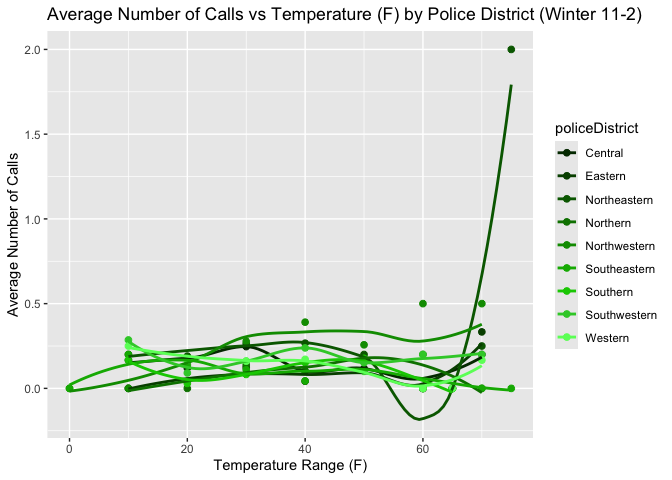
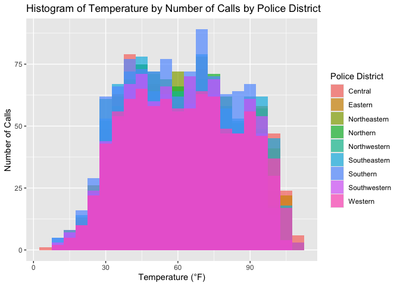
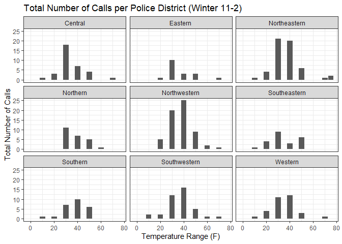
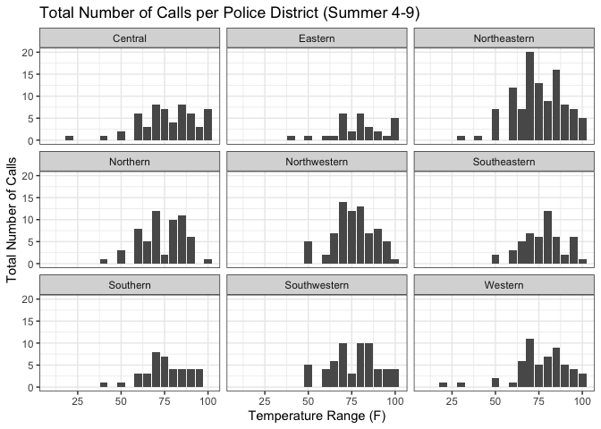

# How does high tempuratures affect mental health in Baltimore City?


Step 1. Install necessary packages.

``` r
install.packages("tidyverse")
install.packages("kableExtra")
```

Step 2. Declare that you will use these packages in this session.

``` r
library("tidyverse")
library("kableExtra")
```

Step 3. Upload the dataframe that you have created in Spring 2024 into
the repository.

Step 4. Open the dataframe into the RStudio Environment.

``` r
df<-read.csv("panel.csv")
df2<-df %>%
  mutate(call_bin = ifelse(callscount>0, 1, 0)) %>%
  mutate(date = as.Date(date)) %>%
  mutate(month = month(date)) %>%
  mutate(dow = weekdays(date))
```

Step 5. Use the **head** and **kable** function showcase the first 10
rows of the dataframe to the reader.

``` r
kable(head(df2))
```

| daytime | policeDistrict | date       | actual_date | year | doy |   temp_K | callscount |   temp_F | call_bin | month | dow      |
|--------:|:---------------|:-----------|------------:|-----:|----:|---------:|-----------:|---------:|---------:|------:|:---------|
|       0 | Central        | 2021-06-06 |     2021156 | 2021 | 156 | 294.5450 |          0 | 70.51100 |        0 |     6 | Sunday   |
|       0 | Central        | 2021-06-07 |     2021157 | 2021 | 157 | 296.9489 |          0 | 74.83800 |        0 |     6 | Monday   |
|       0 | Central        | 2021-06-08 |     2021158 | 2021 | 158 | 298.5400 |          0 | 77.70200 |        0 |     6 | Tuesday  |
|       0 | Central        | 2021-06-17 |     2021167 | 2021 | 167 | 293.4029 |          0 | 68.45514 |        0 |     6 | Thursday |
|       0 | Central        | 2021-06-19 |     2021169 | 2021 | 169 | 292.4600 |          0 | 66.75800 |        0 |     6 | Saturday |
|       0 | Central        | 2021-06-26 |     2021176 | 2021 | 176 | 292.9914 |          0 | 67.71457 |        0 |     6 | Saturday |

## Introduction & Literature Review:

Understanding how temperature affects mental health is crucial for
society. With rising global temperatures, we will have to be prepared
for any impacts that may cause. The years from 2013 to 2023 have been
the warmest to date, with 2023 having the highest surface temperature
ever recorded (NASA, n.d). High temperatures were studied in Baltimore
city through in depth interviews where it was found that at higher heats
people were more prone to mental health problems such as depression and
anxiety. Especially disadvantaged individuals such as people who are
low-income, have disabilities, are homeless, pregnant, elderly people
and children (Diallo et al., 2024). If we were to discover more impacts
that temperature has on individuals, it could guide urban planners to
plan future cities so that they would include public spaces throughout
the city. Additionally, by understanding the psychological effects of
temperature, governments and healthcare providers can better prepare
interventions, such as improving access to mental health services during
extreme temperatures. This research could also lead to targeted policies
that aim to mitigate the mental health impacts of climate change,
ultimately improving societal well-being.

This research project aims to provide the most concentrated area example
of the impacts of temperature on mental health. While existing studies
have found links between mental health worsening and high temperatures,
most have done so for the whole country of the US by county, which makes
it more difficult to definitively control for other factors (Burke et
al., 2018; Srivastava & Mullins., 2024). The data used by Burke et
al. (2018) is based on suicide rates and is from 1968–2004 in the US and
1990-2010 in Mexico by county and analyzed monthly. They found a 0.7%
suicide rate increase in the US per 1.8 degrees Fahrenheit increase in
monthly temperature. 

Srivastava & Mullins (2024) compared the daily frequencies of crisis
line conversations from each county with local average daily
temperatures. They found an 8% increase in crisis line conversations on
days exceeding 86 degrees Fahrenheit compared to days between 64.4 to
69.8 degrees Fahrenheit. 

Besides existing studies on the link between temperatures and mental
health, there are many studies that looked at the impact of temperature
on crime rates. Heilmann et al. (2021) discovered that crime rates in
Los Angeles police districts increase 1.72% when daily temperature
exceeds 75 and 1.90% when daily temperature exceeds 75 and 90 degrees
Fahrenheit. 

Our study will differ from existing studies on temperature and mental
health on several key points. We will be analyzing a more controlled
location and group, focussing on Baltimore City, allowing us to control
for factors specific to the police district. We will be using some of
the same strategies as other studies (Burke et al., 2018; Srivastava &
Mullins., 2024; Heilmann et al., 2021) such as controlling for factors
of precipitation, air quality, and holidays. As well as adding an extra
factor of our own, greenspace. Our data will be more modern mental
health crisis call data from 2021-2023 and analyzed daily to account for
factors such as day of week.

**Bibliography:** 

Burke, M., González, F., Baylis, P., Heft-Neal, S., Baysan, C., Basu,
S., & Hsiang, S. (2018). Higher temperatures increase suicide rates in
the United States and Mexico. Nature Climate Change, 8(8), 723–729.
<https://doi.org/10.1038/s41558-018-0222-x> 

Change, N. G. C. (n.d.). Global Surface Temperature \| NASA Global
Climate Change. Climate Change: Vital Signs of the Planet. Retrieved
October 22, 2024, from
<https://climate.nasa.gov/vital-signs/global-temperature/?intent=121> 

Diallo, I., He, L., Koehler, K., Spira, A. P., Kale, R., Ou, J., Smith,
G., Linton, S. L., & Augustinavicius, J. (2024). Community perspectives
on heat and health in Baltimore City. Urban Climate, 54, 101841.
<https://doi.org/10.1016/j.uclim.2024.101841> 

Heilmann, K., Kahn, M. E., & Tang, C. K. (2021). The urban crime and
heat gradient in high and low poverty areas. Journal of Public
Economics, 197, 104408. <https://doi.org/10.1016/j.jpubeco.2021.104408>

Srivastava, S., & Mullins, J. T. (2024). Temperature, Mental Health, and
Individual Crises: Evidence from Crisis Text Line. American Journal of
Health Economics. <https://doi.org/10.1086/730332> 

## Question 1: What is the frequency of this data frame?

Answer: Daily- day and night

## Question 2: What is the cross-sectional (geographical) unit of this data frame?

Answer: Police district

Step 6. Use the **names** function to display all the variables (column)
in the dataframe.

``` r
names(df2)
```

     [1] "daytime"        "policeDistrict" "date"           "actual_date"   
     [5] "year"           "doy"            "temp_K"         "callscount"    
     [9] "temp_F"         "call_bin"       "month"          "dow"           

## Question 3: Which column represents the treatment variable of interest?

Answer: temp_F

## Question 4: Which column represents the outcome variable of interest?

Answer: call_bin

Step 7: Create a boxplot to visualize the distribution of the outcome
variable under treatment and no treatment.

``` r
# histogram or scatterplots
# total number of calls
# x -> temp_F, y -> callscount (avg for scatterplot)
# groupBy policeDistrict

#----------------------------------------------------------------------------------------------
df2 <- df2 %>%
  mutate(tempCatagories = ifelse(temp_F < 60, 55,
                          ifelse(temp_F >= 60 & temp_F < 65, 60,
                          ifelse(temp_F >= 65 & temp_F < 70, 65,
                          ifelse(temp_F >= 70 & temp_F < 75, 70,
                          ifelse(temp_F >= 75 & temp_F < 80, 75,
                          ifelse(temp_F >= 80 & temp_F < 85, 80,
                          ifelse(temp_F >= 85 & temp_F < 90, 85,
                          ifelse(temp_F >= 90 & temp_F < 95, 90,
                          ifelse(temp_F >= 95 & temp_F < 100, 95, 
                          100))))))))))

# for winter months
df2 <- df2 %>%
  mutate(winter_bin = ifelse(month > 2 & month < 11, 0, 1))
         
# for winter
winter_df <- df2 %>%
  filter(winter_bin == 1) %>%
  group_by(policeDistrict, tempCatagories) %>%
  summarise(avg_calls = mean(callscount, na.rm = TRUE))
```

    `summarise()` has grouped output by 'policeDistrict'. You can override using
    the `.groups` argument.

``` r
# for non winter
non_winter_df <- df2 %>%
  filter(winter_bin == 0) %>%
  group_by(policeDistrict, tempCatagories) %>%
  summarise(avg_calls = mean(callscount, na.rm = TRUE))
```

    `summarise()` has grouped output by 'policeDistrict'. You can override using
    the `.groups` argument.

``` r
# Scatter plot -winter
ggplot(winter_df, aes(x = tempCatagories, y = avg_calls, color = policeDistrict)) + 
  geom_point(size = 2) + 
  geom_smooth(se = FALSE) +
  labs(title = "Average Number of Calls vs Temperature (F) by Police District (Winter)",
       x = "Temperature Range (F)", 
       y = "Average Number of Calls")
```

    `geom_smooth()` using method = 'loess' and formula = 'y ~ x'

    Warning in simpleLoess(y, x, w, span, degree = degree, parametric = parametric,
    : span too small.  fewer data values than degrees of freedom.

    Warning in simpleLoess(y, x, w, span, degree = degree, parametric = parametric,
    : pseudoinverse used at 54.9

    Warning in simpleLoess(y, x, w, span, degree = degree, parametric = parametric,
    : neighborhood radius 10.1

    Warning in simpleLoess(y, x, w, span, degree = degree, parametric = parametric,
    : reciprocal condition number 0

    Warning in simpleLoess(y, x, w, span, degree = degree, parametric = parametric,
    : There are other near singularities as well. 102.01

    Warning in simpleLoess(y, x, w, span, degree = degree, parametric = parametric,
    : span too small.  fewer data values than degrees of freedom.

    Warning in simpleLoess(y, x, w, span, degree = degree, parametric = parametric,
    : pseudoinverse used at 54.9

    Warning in simpleLoess(y, x, w, span, degree = degree, parametric = parametric,
    : neighborhood radius 10.1

    Warning in simpleLoess(y, x, w, span, degree = degree, parametric = parametric,
    : reciprocal condition number 0

    Warning in simpleLoess(y, x, w, span, degree = degree, parametric = parametric,
    : There are other near singularities as well. 102.01

    Warning in simpleLoess(y, x, w, span, degree = degree, parametric = parametric,
    : span too small.  fewer data values than degrees of freedom.

    Warning in simpleLoess(y, x, w, span, degree = degree, parametric = parametric,
    : pseudoinverse used at 54.9

    Warning in simpleLoess(y, x, w, span, degree = degree, parametric = parametric,
    : neighborhood radius 10.1

    Warning in simpleLoess(y, x, w, span, degree = degree, parametric = parametric,
    : reciprocal condition number 0

    Warning in simpleLoess(y, x, w, span, degree = degree, parametric = parametric,
    : There are other near singularities as well. 102.01

    Warning in simpleLoess(y, x, w, span, degree = degree, parametric = parametric,
    : span too small.  fewer data values than degrees of freedom.

    Warning in simpleLoess(y, x, w, span, degree = degree, parametric = parametric,
    : pseudoinverse used at 54.9

    Warning in simpleLoess(y, x, w, span, degree = degree, parametric = parametric,
    : neighborhood radius 10.1

    Warning in simpleLoess(y, x, w, span, degree = degree, parametric = parametric,
    : reciprocal condition number 0

    Warning in simpleLoess(y, x, w, span, degree = degree, parametric = parametric,
    : There are other near singularities as well. 102.01

    Warning in simpleLoess(y, x, w, span, degree = degree, parametric = parametric,
    : span too small.  fewer data values than degrees of freedom.

    Warning in simpleLoess(y, x, w, span, degree = degree, parametric = parametric,
    : pseudoinverse used at 54.9

    Warning in simpleLoess(y, x, w, span, degree = degree, parametric = parametric,
    : neighborhood radius 10.1

    Warning in simpleLoess(y, x, w, span, degree = degree, parametric = parametric,
    : reciprocal condition number 0

    Warning in simpleLoess(y, x, w, span, degree = degree, parametric = parametric,
    : There are other near singularities as well. 102.01

    Warning in simpleLoess(y, x, w, span, degree = degree, parametric = parametric,
    : span too small.  fewer data values than degrees of freedom.

    Warning in simpleLoess(y, x, w, span, degree = degree, parametric = parametric,
    : pseudoinverse used at 54.9

    Warning in simpleLoess(y, x, w, span, degree = degree, parametric = parametric,
    : neighborhood radius 10.1

    Warning in simpleLoess(y, x, w, span, degree = degree, parametric = parametric,
    : reciprocal condition number 0

    Warning in simpleLoess(y, x, w, span, degree = degree, parametric = parametric,
    : There are other near singularities as well. 102.01

    Warning in simpleLoess(y, x, w, span, degree = degree, parametric = parametric,
    : span too small.  fewer data values than degrees of freedom.

    Warning in simpleLoess(y, x, w, span, degree = degree, parametric = parametric,
    : pseudoinverse used at 54.925

    Warning in simpleLoess(y, x, w, span, degree = degree, parametric = parametric,
    : neighborhood radius 10.075

    Warning in simpleLoess(y, x, w, span, degree = degree, parametric = parametric,
    : reciprocal condition number 0

    Warning in simpleLoess(y, x, w, span, degree = degree, parametric = parametric,
    : There are other near singularities as well. 101.51

    Warning in simpleLoess(y, x, w, span, degree = degree, parametric = parametric,
    : span too small.  fewer data values than degrees of freedom.

    Warning in simpleLoess(y, x, w, span, degree = degree, parametric = parametric,
    : pseudoinverse used at 54.9

    Warning in simpleLoess(y, x, w, span, degree = degree, parametric = parametric,
    : neighborhood radius 10.1

    Warning in simpleLoess(y, x, w, span, degree = degree, parametric = parametric,
    : reciprocal condition number 0

    Warning in simpleLoess(y, x, w, span, degree = degree, parametric = parametric,
    : There are other near singularities as well. 102.01

    Warning in simpleLoess(y, x, w, span, degree = degree, parametric = parametric,
    : span too small.  fewer data values than degrees of freedom.

    Warning in simpleLoess(y, x, w, span, degree = degree, parametric = parametric,
    : pseudoinverse used at 54.9

    Warning in simpleLoess(y, x, w, span, degree = degree, parametric = parametric,
    : neighborhood radius 10.1

    Warning in simpleLoess(y, x, w, span, degree = degree, parametric = parametric,
    : reciprocal condition number 0

    Warning in simpleLoess(y, x, w, span, degree = degree, parametric = parametric,
    : There are other near singularities as well. 102.01



``` r
# Scatter plot -non_winter
ggplot(non_winter_df, aes(x = tempCatagories, y = avg_calls, color = policeDistrict)) + 
  geom_point(size = 2) + 
  geom_smooth(se = FALSE) +
  labs(title = "Average Number of Calls vs Temperature (F) by Police District (Non Winter)",
       x = "Temperature Range (F)", 
       y = "Average Number of Calls")
```

    `geom_smooth()` using method = 'loess' and formula = 'y ~ x'



``` r
#----------------------------------------------------------------------------------------------

# for winter
df_winter <- df2 %>%
  filter(winter_bin == 1) %>%
  group_by(policeDistrict, tempCatagories) %>%
  summarize(total_callscount = sum(callscount))
```

    `summarise()` has grouped output by 'policeDistrict'. You can override using
    the `.groups` argument.

``` r
# for non winter
df_non_winter <- df2 %>%
  filter(winter_bin == 0) %>%
  group_by(policeDistrict, tempCatagories) %>%
  summarize(total_callscount = sum(callscount))
```

    `summarise()` has grouped output by 'policeDistrict'. You can override using
    the `.groups` argument.

``` r
# Grouped bar graph -winter
ggplot(df_winter, aes(x = tempCatagories, y = total_callscount)) + 
    geom_bar(stat="identity") +
    facet_wrap((~ as.character(policeDistrict))) +
    labs(title = "Total Number of Calls per Police District (Winter)",
       x = "Temperature Range (F)", 
       y = "Total Number of Calls")
```



``` r
# Grouped bar graph - non_winter
ggplot(df_non_winter, aes(x = tempCatagories, y = total_callscount)) + 
    geom_bar(stat="identity") +
    facet_wrap((~ as.character(policeDistrict))) +
    labs(title = "Total Number of Calls per Police District (Non Winter)",
       x = "Temperature Range (F)", 
       y = "Total Number of Calls")
```



  
  


Step 8: Fit a regression model $y=\beta_0 + \beta_1 x + \epsilon$ where
$y$ is the outcome variable and $x$ is the treatment variable. Use the
**summary** function to display the results.

``` r
model1<-lm(call_bin ~ temp_F, data=df2)

summary(model1)
```


    Call:
    lm(formula = call_bin ~ temp_F, data = df2)

    Residuals:
         Min       1Q   Median       3Q      Max 
    -0.09024 -0.08269 -0.07875 -0.07461  0.92955 

    Coefficients:
                  Estimate Std. Error t value Pr(>|t|)    
    (Intercept)  0.0917032  0.0086954  10.546   <2e-16 ***
    temp_F      -0.0001999  0.0001329  -1.505    0.132    
    ---
    Signif. codes:  0 '***' 0.001 '**' 0.01 '*' 0.05 '.' 0.1 ' ' 1

    Residual standard error: 0.2703 on 8450 degrees of freedom
    Multiple R-squared:  0.0002679, Adjusted R-squared:  0.0001496 
    F-statistic: 2.264 on 1 and 8450 DF,  p-value: 0.1324

## Question 7: What is the equation that describes the linear regression above? Please include an explanation of the variables and subscripts.

Answer:

$$
callscount_{pdt} = \beta_0 + \beta_1 temp_{pdt} + \gamma_p + \eta_d + \theta_{dayofweek} + \omega_{month} + \pi_year+\epsilon_{pdt}
$$

Where $callscount$ represents the outcome variable that shows whether
there a call from police district \$p\$, on day \$d\$, at time of day
\$t\$.

Where $temp$ determines the temperature in Fahrenheit.

Data Description:

- Outcome variable: whether there was a call or not per day.

- Treatment variable: temperature

- Frequency and geographical Unit: daily day and night and police
  district

- Treated Group: \# of call on a hot weekday in a specific month in a
  police district

- Untreated Group:# of call on a cool weekday in a specific month in a
  police district

## Question 8: What fixed effects can be included in the regression? What does each fixed effects control for? Please include a new equation that incorporates the fixed effects.

Answer:

Police district: controls for better or worse conditions in the city

Daytime: controls the differences that might occur based on the time of
day

Year: controls any differences that might have occurred one year to
another

## Question 9: What is the impact of the treatment effect once fixed effects are included?

Answer:

``` r
#install.packages("lfe")
library("lfe")

model2<-felm(call_bin ~ temp_F + daytime + temp_F:daytime| 
               policeDistrict + year + month + dow, data=df2)

summary(model2)
```


    Call:
       felm(formula = call_bin ~ temp_F + daytime + temp_F:daytime |      policeDistrict + year + month + dow, data = df2) 

    Residuals:
         Min       1Q   Median       3Q      Max 
    -0.17312 -0.09836 -0.07288 -0.04830  0.98544 

    Coefficients:
                     Estimate Std. Error t value Pr(>|t|)
    temp_F          1.930e-04  4.406e-04   0.438    0.661
    daytime        -2.704e-02  2.037e-02  -1.327    0.184
    temp_F:daytime -3.456e-05  3.188e-04  -0.108    0.914

    Residual standard error: 0.2689 on 8421 degrees of freedom
    Multiple R-squared(full model): 0.0145   Adjusted R-squared: 0.01099 
    Multiple R-squared(proj model): 0.002268   Adjusted R-squared: -0.001287 
    F-statistic(full model): 4.13 on 30 and 8421 DF, p-value: 2.94e-13 
    F-statistic(proj model):  6.38 on 3 and 8421 DF, p-value: 0.0002584 
    *** Standard errors may be too high due to more than 2 groups and exactDOF=FALSE

``` r
# for the temperature range
df3<-df2 %>%
  mutate(temp_over_100=ifelse(temp_F>100, 1, 0)) %>%
  mutate(temp_95_100=ifelse(temp_F> 95 & temp_F<=100, 1, 0)) %>%
  mutate(temp_90_95=ifelse(temp_F> 90 & temp_F<=95, 1, 0)) %>%
  mutate(temp_85_90=ifelse(temp_F> 85 & temp_F<=90, 1, 0)) %>%
  mutate(temp_80_85=ifelse(temp_F> 80 & temp_F<=85, 1, 0)) %>%
  mutate(temp_75_80=ifelse(temp_F> 75 & temp_F<=80, 1, 0)) %>%
  mutate(temp_70_75=ifelse(temp_F> 70 & temp_F<=75, 1, 0)) %>%
  mutate(temp_65_70=ifelse(temp_F> 65 & temp_F<=70, 1, 0)) %>%
  mutate(temp_60_65=ifelse(temp_F> 60 & temp_F<=65, 1, 0)) %>%
  mutate(temp_under_60=ifelse(temp_F<= 60, 1, 0))

#-------#

#2021 - 2022 (from the website: https://patch.com/maryland/baltimore/back-school-baltimore-city #-2021-22-school-calendar) (Not full but )
#2022 - 2023
#2023 - 2024 (upto Dec 31)

holidays <- as.Date(c(
"2021-5-31", "2021-6-19", "2021-7-4",

"2021-9-6", "2021-11-2", "2021-11-25", "2021-11-26", "2021-12-24", "2021-12-25", "2021-12-26", "2021-12-27", "2021-12-28", "2021-12-29", "2021-12-30", "2021-12-31", "2022-1-1", "2022-1-2", "2022-1-17", "2022-2-18", "2022-2-21", "2022-3-18", "2022-4-11", "2022-4-12", "2022-4-13", "2022-4-14", "2022-4-15", "2022-4-16", "2022-4-17", "2022-4-18", "2022-5-30", "2022-6-19", "2022-7-4",

"2022-9-5", "2022-10-5", "2022-10-21", "2022-11-8", "2022-11-9", "2022-11-23", "2022-11-24", "2022-11-25", "2022-12-23", "2022-12-24", "2022-12-25", "2021-12-26", "2022-12-27", "2022-12-28", "2022-12-29", "2022-12-30", "2022-12-31", "2023-01-01", "2023-1-2", "2023-1-16", "2023-1-23", "2023-2-17", "2023-2-20", "2023-3-8", "2023-3-17", "2023-4-3", "2023-4-4", "2023-4-5", "2023-4-6", "2023-4-7", "2023-4-8", "2023-4-9", "2023-4-10", "2023-4-21", "2023-5-29",  "2023-6-19", "2023-7-4", 

"2023-9-4", "2023-10-20", "2023-11-22", "2023-11-23", "2023-11-24", "2023-12-22", "2023-12-23", "2023-12-24", "2023-12-25", "2023-12-26", "2023-12-27", "2023-12-28", "2023-12-29", "2023-12-30", "2023-12-31"))

#For adding the holidays column into the data frame
df3 <- df3 %>%
  mutate(holiday_bin = ifelse(date %in% holidays, 1, 0))

#-------#

#dayOfTheWeek Holiday Results


# split these into 2 for winter non winter months

model2<-felm(call_bin ~ temp_over_100 + temp_95_100 + temp_90_95 + temp_85_90 + temp_80_85 + temp_75_80 + temp_70_75 + temp_65_70 + temp_60_65 + temp_under_60 + holiday_bin + holiday_bin:daytime + daytime + temp_over_100:daytime + temp_95_100: daytime + temp_90_95: daytime + temp_85_90: daytime + temp_80_85: daytime + temp_75_80: daytime + temp_70_75: daytime + temp_65_70: daytime + temp_60_65: daytime + temp_under_60| 
               policeDistrict + year + month + dow, data=df3)

model3<-felm(call_bin ~ temp_over_100 + temp_95_100 + temp_90_95 + temp_85_90 + temp_80_85 + temp_75_80 + temp_70_75 + temp_65_70 + temp_60_65 + temp_under_60 + daytime + holiday_bin + holiday_bin:daytime + temp_over_100:daytime + temp_95_100: daytime + temp_90_95: daytime + temp_85_90: daytime + temp_80_85: daytime + temp_75_80: daytime + temp_70_75: daytime + temp_65_70: daytime + temp_60_65: daytime + temp_under_60| 
               policeDistrict + year + dow, data=df3)

summary(model2)
```


    Call:
       felm(formula = call_bin ~ temp_over_100 + temp_95_100 + temp_90_95 +      temp_85_90 + temp_80_85 + temp_75_80 + temp_70_75 + temp_65_70 +      temp_60_65 + temp_under_60 + holiday_bin + holiday_bin:daytime +      daytime + temp_over_100:daytime + temp_95_100:daytime + temp_90_95:daytime +      temp_85_90:daytime + temp_80_85:daytime + temp_75_80:daytime +      temp_70_75:daytime + temp_65_70:daytime + temp_60_65:daytime +      temp_under_60 | policeDistrict + year + month + dow, data = df3) 

    Residuals:
         Min       1Q   Median       3Q      Max 
    -0.19410 -0.09857 -0.07214 -0.04635  1.00512 

    Coefficients:
                            Estimate Std. Error t value Pr(>|t|)  
    temp_over_100                NaN         NA     NaN      NaN  
    temp_95_100           -0.0059683  0.0229512  -0.260   0.7948  
    temp_90_95            -0.0329493  0.0226781  -1.453   0.1463  
    temp_85_90            -0.0081357  0.0229528  -0.354   0.7230  
    temp_80_85            -0.0662120  0.0569773  -1.162   0.2452  
    temp_75_80            -0.0244416  0.0258776  -0.945   0.3449  
    temp_70_75             0.0113368  0.0254853   0.445   0.6564  
    temp_65_70            -0.0111460  0.0256284  -0.435   0.6636  
    temp_60_65            -0.0119351  0.0266014  -0.449   0.6537  
    temp_under_60         -0.0231465  0.0255194  -0.907   0.3644  
    holiday_bin            0.0146609  0.0143046   1.025   0.3054  
    daytime               -0.0217080  0.0098654  -2.200   0.0278 *
    holiday_bin:daytime   -0.0089105  0.0206048  -0.432   0.6654  
    temp_over_100:daytime        NaN         NA     NaN      NaN  
    temp_95_100:daytime          NaN         NA     NaN      NaN  
    temp_90_95:daytime           NaN         NA     NaN      NaN  
    temp_85_90:daytime           NaN         NA     NaN      NaN  
    temp_80_85:daytime     0.0238370  0.0558956   0.426   0.6698  
    temp_75_80:daytime    -0.0008528  0.0269323  -0.032   0.9747  
    temp_70_75:daytime    -0.0072356  0.0275893  -0.262   0.7931  
    temp_65_70:daytime    -0.0166072  0.0256621  -0.647   0.5176  
    temp_60_65:daytime    -0.0205137  0.0280212  -0.732   0.4641  
    ---
    Signif. codes:  0 '***' 0.001 '**' 0.01 '*' 0.05 '.' 0.1 ' ' 1

    Residual standard error: 0.2689 on 8407 degrees of freedom
    Multiple R-squared(full model): 0.01628   Adjusted R-squared: 0.01113 
    Multiple R-squared(proj model): 0.004068   Adjusted R-squared: -0.001145 
    F-statistic(full model):3.162 on 44 and 8407 DF, p-value: 1.108e-11 
    F-statistic(proj model): 1.561 on 22 and 8407 DF, p-value: 0.04568 
    *** Standard errors may be too high due to more than 2 groups and exactDOF=FALSE

``` r
summary(model3)
```


    Call:
       felm(formula = call_bin ~ temp_over_100 + temp_95_100 + temp_90_95 +      temp_85_90 + temp_80_85 + temp_75_80 + temp_70_75 + temp_65_70 +      temp_60_65 + temp_under_60 + daytime + holiday_bin + holiday_bin:daytime +      temp_over_100:daytime + temp_95_100:daytime + temp_90_95:daytime +      temp_85_90:daytime + temp_80_85:daytime + temp_75_80:daytime +      temp_70_75:daytime + temp_65_70:daytime + temp_60_65:daytime +      temp_under_60 | policeDistrict + year + dow, data = df3) 

    Residuals:
         Min       1Q   Median       3Q      Max 
    -0.18716 -0.09822 -0.07301 -0.04770  1.00634 

    Coefficients:
                            Estimate Std. Error t value Pr(>|t|)  
    temp_over_100          0.0072473  0.0228199   0.318   0.7508  
    temp_95_100                  NaN         NA     NaN      NaN  
    temp_90_95            -0.0266519  0.0183377  -1.453   0.1462  
    temp_85_90            -0.0007227  0.0179483  -0.040   0.9679  
    temp_80_85            -0.0571413  0.0552775  -1.034   0.3013  
    temp_75_80            -0.0171186  0.0222374  -0.770   0.4414  
    temp_70_75             0.0172970  0.0217086   0.797   0.4256  
    temp_65_70            -0.0060789  0.0213149  -0.285   0.7755  
    temp_60_65            -0.0056254  0.0213336  -0.264   0.7920  
    temp_under_60         -0.0132854  0.0153528  -0.865   0.3869  
    daytime               -0.0228457  0.0093298  -2.449   0.0144 *
    holiday_bin            0.0122095  0.0140028   0.872   0.3833  
    daytime:holiday_bin   -0.0083655  0.0204815  -0.408   0.6830  
    temp_over_100:daytime        NaN         NA     NaN      NaN  
    temp_95_100:daytime          NaN         NA     NaN      NaN  
    temp_90_95:daytime           NaN         NA     NaN      NaN  
    temp_85_90:daytime           NaN         NA     NaN      NaN  
    temp_80_85:daytime     0.0237024  0.0553083   0.429   0.6683  
    temp_75_80:daytime     0.0022584  0.0242758   0.093   0.9259  
    temp_70_75:daytime    -0.0006016  0.0248375  -0.024   0.9807  
    temp_65_70:daytime    -0.0092256  0.0235930  -0.391   0.6958  
    temp_60_65:daytime    -0.0116907  0.0268645  -0.435   0.6634  
    ---
    Signif. codes:  0 '***' 0.001 '**' 0.01 '*' 0.05 '.' 0.1 ' ' 1

    Residual standard error: 0.2688 on 8418 degrees of freedom
    Multiple R-squared(full model): 0.01551   Adjusted R-squared: 0.01165 
    Multiple R-squared(proj model): 0.004044   Adjusted R-squared: 0.0001396 
    F-statistic(full model):4.019 on 33 and 8418 DF, p-value: 9.26e-14 
    F-statistic(proj model): 1.554 on 22 and 8418 DF, p-value: 0.04741 
    *** Standard errors may be too high due to more than 2 groups and exactDOF=FALSE

## Question 10: What are the next steps of your research?

Future Plans:

- Alter the graph so that it shows the relationship between specific
  temperature periods to the number of calls

- Incorporate methods and strategies from official articles into our
  research paper.

- Control for trees, precipitation and air quality

- Identify factors that impacts temperature and number of calls at the
  same time.

  - precipitation

  - trees

  - air quality

Step 9: Change the document format to gfm

Step 10: Save this document as README.qmd

Step 11: Render the document. README.md file should be created after
this process.

Step 12: Push the document back to GitHub and observe your beautiful
document in your repository!

Step 13: If your team has a complete dataframe that includes both the
treated and outcome variable, you are done with the assignment. If not,
make a research plan in Notion to collect data on the outcome and
treatment variable and combine it into one dataframe.
