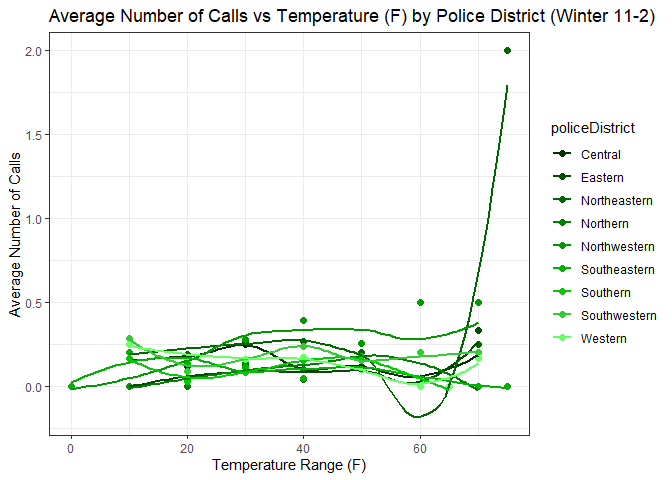

# How does high tempuratures affect mental health in Baltimore City?


Step 1. Install necessary packages.

``` r
install.packages("tidyverse")
install.packages("kableExtra")
```

Step 2. Declare that you will use these packages in this session.

``` r
library("tidyverse")
```

    ── Attaching core tidyverse packages ──────────────────────── tidyverse 2.0.0 ──
    ✔ dplyr     1.1.4     ✔ readr     2.1.5
    ✔ forcats   1.0.0     ✔ stringr   1.5.1
    ✔ ggplot2   3.5.1     ✔ tibble    3.2.1
    ✔ lubridate 1.9.3     ✔ tidyr     1.3.1
    ✔ purrr     1.0.2     
    ── Conflicts ────────────────────────────────────────── tidyverse_conflicts() ──
    ✖ dplyr::filter() masks stats::filter()
    ✖ dplyr::lag()    masks stats::lag()
    ℹ Use the conflicted package (<http://conflicted.r-lib.org/>) to force all conflicts to become errors

``` r
library("kableExtra")
```


    Attaching package: 'kableExtra'

    The following object is masked from 'package:dplyr':

        group_rows

Step 3. Upload the dataframe that you have created in Spring 2024 into
the repository.

Step 4. Open the dataframe into the RStudio Environment.

``` r
df<-read.csv("panel.csv")
df2<-df %>%
  mutate(call_bin = ifelse(callscount>0, 1, 0)) %>%
  mutate(date = as.Date(date)) %>%
  mutate(month = month(date)) %>%
  mutate(dow = weekdays(date))
```

Step 5. Use the **head** and **kable** function showcase the first 10
rows of the dataframe to the reader.

``` r
kable(head(df2))
```

| daytime | policeDistrict | date       | actual_date | year | doy |   temp_K | callscount |   temp_F | call_bin | month | dow      |
|--------:|:---------------|:-----------|------------:|-----:|----:|---------:|-----------:|---------:|---------:|------:|:---------|
|       0 | Central        | 2021-06-06 |     2021156 | 2021 | 156 | 294.5450 |          0 | 70.51100 |        0 |     6 | Sunday   |
|       0 | Central        | 2021-06-07 |     2021157 | 2021 | 157 | 296.9489 |          0 | 74.83800 |        0 |     6 | Monday   |
|       0 | Central        | 2021-06-08 |     2021158 | 2021 | 158 | 298.5400 |          0 | 77.70200 |        0 |     6 | Tuesday  |
|       0 | Central        | 2021-06-17 |     2021167 | 2021 | 167 | 293.4029 |          0 | 68.45514 |        0 |     6 | Thursday |
|       0 | Central        | 2021-06-19 |     2021169 | 2021 | 169 | 292.4600 |          0 | 66.75800 |        0 |     6 | Saturday |
|       0 | Central        | 2021-06-26 |     2021176 | 2021 | 176 | 292.9914 |          0 | 67.71457 |        0 |     6 | Saturday |

## Question 1: What is the frequency of this data frame?

Answer: Daily- day and night

## Question 2: What is the cross-sectional (geographical) unit of this data frame?

Answer: Police district

Step 6. Use the **names** function to display all the variables (column)
in the dataframe.

``` r
names(df2)
```

     [1] "daytime"        "policeDistrict" "date"           "actual_date"   
     [5] "year"           "doy"            "temp_K"         "callscount"    
     [9] "temp_F"         "call_bin"       "month"          "dow"           

## Question 3: Which column represents the treatment variable of interest?

Answer: temp_F

## Question 4: Which column represents the outcome variable of interest?

Answer: call_bin

Step 7: Create a boxplot to visualize the distribution of the outcome
variable under treatment and no treatment.

``` r
ggplot(df2, aes(x=temp_F)) +
  geom_boxplot() +
  facet_wrap(~call_bin)
```




Step 8: Fit a regression model $y=\beta_0 + \beta_1 x + \epsilon$ where
$y$ is the outcome variable and $x$ is the treatment variable. Use the
**summary** function to display the results.

``` r
model1<-lm(call_bin ~ temp_F, data=df2)

summary(model1)
```


    Call:
    lm(formula = call_bin ~ temp_F, data = df2)

    Residuals:
         Min       1Q   Median       3Q      Max 
    -0.09024 -0.08269 -0.07875 -0.07461  0.92955 

    Coefficients:
                  Estimate Std. Error t value Pr(>|t|)    
    (Intercept)  0.0917032  0.0086954  10.546   <2e-16 ***
    temp_F      -0.0001999  0.0001329  -1.505    0.132    
    ---
    Signif. codes:  0 '***' 0.001 '**' 0.01 '*' 0.05 '.' 0.1 ' ' 1

    Residual standard error: 0.2703 on 8450 degrees of freedom
    Multiple R-squared:  0.0002679, Adjusted R-squared:  0.0001496 
    F-statistic: 2.264 on 1 and 8450 DF,  p-value: 0.1324

## Question 7: What is the equation that describes the linear regression above? Please include an explanation of the variables and subscripts.

Answer:

$$
callscount_{pdt} = \beta_0 + \beta_1 temp_{pdt} + \epsilon_{pdt}
$$

Where $callscount$ represents the outcome variable that shows whether
there a call from police district \$p\$, on day \$d\$, at time of day
\$t\$.

Where $temp$ determines the temperature in Fahrenheit.

## Question 8: What fixed effects can be included in the regression? What does each fixed effects control for? Please include a new equation that incorporates the fixed effects.

Answer:

Police district: controls for better or worse conditions in the city

Daytime: controls the differences that might occur based on the time of
day

Year: controls any differences that might have occurred one year to
another

## Question 9: What is the impact of the treatment effect once fixed effects are included?

Answer:

``` r
#install.packages("lfe")
library("lfe")
```

    Loading required package: Matrix


    Attaching package: 'Matrix'

    The following objects are masked from 'package:tidyr':

        expand, pack, unpack

``` r
model2<-felm(temp_F ~ call_bin | policeDistrict + daytime + year + month + dow, data=df2)

summary(model2)
```


    Call:
       felm(formula = temp_F ~ call_bin | policeDistrict + daytime +      year + month + dow, data = df2) 

    Residuals:
        Min      1Q  Median      3Q     Max 
    -44.145  -4.917   0.114   5.001  29.583 

    Coefficients:
             Estimate Std. Error t value Pr(>|t|)
    call_bin   0.1430     0.3183   0.449    0.653

    Residual standard error: 7.852 on 8422 degrees of freedom
    Multiple R-squared(full model): 0.8746   Adjusted R-squared: 0.8741 
    Multiple R-squared(proj model): 2.396e-05   Adjusted R-squared: -0.003419 
    F-statistic(full model): 2025 on 29 and 8422 DF, p-value: < 2.2e-16 
    F-statistic(proj model): 0.2018 on 1 and 8422 DF, p-value: 0.6533 
    *** Standard errors may be too high due to more than 2 groups and exactDOF=FALSE

# Questions for Week 5

## Question 10: In a difference-in-differences (DiD) model, what is the treatment GROUP?

Answer:

## Question 11: In a DiD model, what are the control groups?

Answer:

## Question 12: What is the DiD regression equation that will answer your research question?

## Question 13: Run your DiD regressions below. What are the results of the DiD regression?

## Question 14: What are the next steps of your research?

Step 9: Change the document format to gfm

Step 10: Save this document as README.qmd

Step 11: Render the document. README.md file should be created after
this process.

Step 12: Push the document back to GitHub and observe your beautiful
document in your repository!

Step 13: If your team has a complete dataframe that includes both the
treated and outcome variable, you are done with the assignment. If not,
make a research plan in Notion to collect data on the outcome and
treatment variable and combine it into one dataframe.
