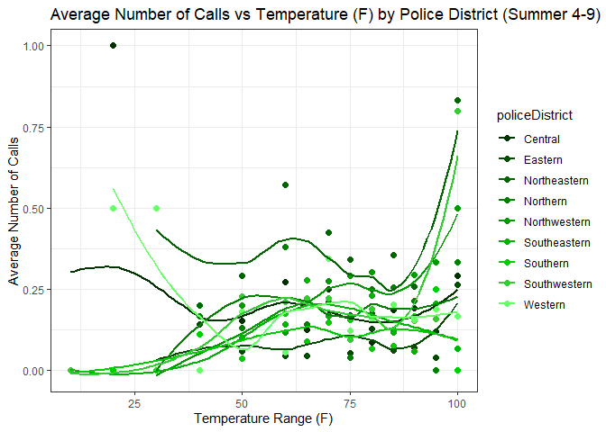

# How does high tempuratures affect mental health in Baltimore City?


Step 1. Install necessary packages.

``` r
install.packages("tidyverse")
install.packages("kableExtra")
```

Step 2. Declare that you will use these packages in this session.

``` r
library("tidyverse")
```

    ── Attaching core tidyverse packages ──────────────────────── tidyverse 2.0.0 ──
    ✔ dplyr     1.1.4     ✔ readr     2.1.5
    ✔ forcats   1.0.0     ✔ stringr   1.5.1
    ✔ ggplot2   3.5.1     ✔ tibble    3.2.1
    ✔ lubridate 1.9.3     ✔ tidyr     1.3.1
    ✔ purrr     1.0.2     
    ── Conflicts ────────────────────────────────────────── tidyverse_conflicts() ──
    ✖ dplyr::filter() masks stats::filter()
    ✖ dplyr::lag()    masks stats::lag()
    ℹ Use the conflicted package (<http://conflicted.r-lib.org/>) to force all conflicts to become errors

``` r
library("kableExtra")
```


    Attaching package: 'kableExtra'

    The following object is masked from 'package:dplyr':

        group_rows

Step 3. Upload the dataframe that you have created in Spring 2024 into
the repository.

Step 4. Open the dataframe into the RStudio Environment.

``` r
df<-read.csv("panel.csv")
df2<-df %>%
  mutate(call_bin = ifelse(callscount>0, 1, 0)) %>%
  mutate(date = as.Date(date)) %>%
  mutate(month = month(date)) %>%
  mutate(dow = weekdays(date))
```

Step 5. Use the **head** and **kable** function showcase the first 10
rows of the dataframe to the reader.

``` r
kable(head(df2))
```

| daytime | policeDistrict | date       | actual_date | year | doy |   temp_K | callscount |   temp_F | call_bin | month | dow      |
|--------:|:---------------|:-----------|------------:|-----:|----:|---------:|-----------:|---------:|---------:|------:|:---------|
|       0 | Central        | 2021-06-06 |     2021156 | 2021 | 156 | 294.5450 |          0 | 70.51100 |        0 |     6 | Sunday   |
|       0 | Central        | 2021-06-07 |     2021157 | 2021 | 157 | 296.9489 |          0 | 74.83800 |        0 |     6 | Monday   |
|       0 | Central        | 2021-06-08 |     2021158 | 2021 | 158 | 298.5400 |          0 | 77.70200 |        0 |     6 | Tuesday  |
|       0 | Central        | 2021-06-17 |     2021167 | 2021 | 167 | 293.4029 |          0 | 68.45514 |        0 |     6 | Thursday |
|       0 | Central        | 2021-06-19 |     2021169 | 2021 | 169 | 292.4600 |          0 | 66.75800 |        0 |     6 | Saturday |
|       0 | Central        | 2021-06-26 |     2021176 | 2021 | 176 | 292.9914 |          0 | 67.71457 |        0 |     6 | Saturday |

## Question 1: What is the frequency of this data frame?

Answer: Daily- day and night

## Question 2: What is the cross-sectional (geographical) unit of this data frame?

Answer: Police district

Step 6. Use the **names** function to display all the variables (column)
in the dataframe.

``` r
names(df2)
```

     [1] "daytime"        "policeDistrict" "date"           "actual_date"   
     [5] "year"           "doy"            "temp_K"         "callscount"    
     [9] "temp_F"         "call_bin"       "month"          "dow"           

## Question 3: Which column represents the treatment variable of interest?

Answer: temp_F

## Question 4: Which column represents the outcome variable of interest?

Answer: call_bin

Step 7: Create a boxplot to visualize the distribution of the outcome
variable under treatment and no treatment.

``` r
# histogram or scatterplots
# total number of calls
# x -> temp_F, y -> callscount (avg for scatterplot)
# groupBy policeDistrict

#----------------------------------------------------------------------------------------------
df2 <- df2 %>%
  mutate(tempCatagories = ifelse(temp_F < 60, 55,
                          ifelse(temp_F >= 60 & temp_F < 65, 60,
                          ifelse(temp_F >= 65 & temp_F < 70, 65,
                          ifelse(temp_F >= 70 & temp_F < 75, 70,
                          ifelse(temp_F >= 75 & temp_F < 80, 75,
                          ifelse(temp_F >= 80 & temp_F < 85, 80,
                          ifelse(temp_F >= 85 & temp_F < 90, 85,
                          ifelse(temp_F >= 90 & temp_F < 95, 90,
                          ifelse(temp_F >= 95 & temp_F < 100, 95, 
                          100))))))))))

avg_df <- df2 %>%
  group_by(policeDistrict, tempCatagories) %>%
  summarise(avg_calls = mean(callscount, na.rm = TRUE))
```

    `summarise()` has grouped output by 'policeDistrict'. You can override using
    the `.groups` argument.

``` r
# Step 2: Create the scatter plot
ggplot(avg_df, aes(x = tempCatagories, y = avg_calls, color = policeDistrict)) + 
  geom_point(size = 2) + 
  geom_smooth(method = "lm", se = FALSE) +
  labs(title = "Average Number of Calls vs Temperature (F) by Police District",
       x = "Temperature Range (F)", 
       y = "Average Number of Calls")
```

    `geom_smooth()` using formula = 'y ~ x'


``` r
#-------#
ggplot(df2, aes(x = temp_F, fill = policeDistrict)) +
  geom_histogram(binwidth = 5, position = "identity", alpha = 0.7) +
  labs(x = "Temperature (°F)", y = "Number of Calls", fill = "Police District") +
  ggtitle("Histogram of Temperature by Number of Calls by Police District")
```



``` r
#-------#

ggplot(df2, aes(x=policeDistrict, y=temp_F)) + 
  geom_bar(stat = "identity")
```


Step 8: Fit a regression model $y=\beta_0 + \beta_1 x + \epsilon$ where
$y$ is the outcome variable and $x$ is the treatment variable. Use the
**summary** function to display the results.

``` r
model1<-lm(call_bin ~ temp_F, data=df2)

summary(model1)
```


    Call:
    lm(formula = call_bin ~ temp_F, data = df2)

    Residuals:
         Min       1Q   Median       3Q      Max 
    -0.09024 -0.08269 -0.07875 -0.07461  0.92955 

    Coefficients:
                  Estimate Std. Error t value Pr(>|t|)    
    (Intercept)  0.0917032  0.0086954  10.546   <2e-16 ***
    temp_F      -0.0001999  0.0001329  -1.505    0.132    
    ---
    Signif. codes:  0 '***' 0.001 '**' 0.01 '*' 0.05 '.' 0.1 ' ' 1

    Residual standard error: 0.2703 on 8450 degrees of freedom
    Multiple R-squared:  0.0002679, Adjusted R-squared:  0.0001496 
    F-statistic: 2.264 on 1 and 8450 DF,  p-value: 0.1324

## Question 7: What is the equation that describes the linear regression above? Please include an explanation of the variables and subscripts.

Answer:

$$
callscount_{pdt} = \beta_0 + \beta_1 temp_{pdt} + \gamma_p + \eta_d + \theta_{dayofweek} + \omega_{month} + \pi_year+\epsilon_{pdt}
$$

Where $callscount$ represents the outcome variable that shows whether
there a call from police district \$p\$, on day \$d\$, at time of day
\$t\$.

Where $temp$ determines the temperature in Fahrenheit.

## Question 8: What fixed effects can be included in the regression? What does each fixed effects control for? Please include a new equation that incorporates the fixed effects.

Answer:

Police district: controls for better or worse conditions in the city

Daytime: controls the differences that might occur based on the time of
day

Year: controls any differences that might have occurred one year to
another

## Question 9: What is the impact of the treatment effect once fixed effects are included?

Answer:

``` r
#install.packages("lfe")
library("lfe")
```

    Loading required package: Matrix


    Attaching package: 'Matrix'

    The following objects are masked from 'package:tidyr':

        expand, pack, unpack

``` r
model2<-felm(call_bin ~ temp_F + daytime + temp_F:daytime| 
               policeDistrict + year + month + dow, data=df2)

summary(model2)
```


    Call:
       felm(formula = call_bin ~ temp_F + daytime + temp_F:daytime |      policeDistrict + year + month + dow, data = df2) 

    Residuals:
         Min       1Q   Median       3Q      Max 
    -0.17312 -0.09836 -0.07288 -0.04830  0.98544 

    Coefficients:
                     Estimate Std. Error t value Pr(>|t|)
    temp_F          1.930e-04  4.406e-04   0.438    0.661
    daytime        -2.704e-02  2.037e-02  -1.327    0.184
    temp_F:daytime -3.456e-05  3.188e-04  -0.108    0.914

    Residual standard error: 0.2689 on 8421 degrees of freedom
    Multiple R-squared(full model): 0.0145   Adjusted R-squared: 0.01099 
    Multiple R-squared(proj model): 0.002268   Adjusted R-squared: -0.001287 
    F-statistic(full model): 4.13 on 30 and 8421 DF, p-value: 2.94e-13 
    F-statistic(proj model):  6.38 on 3 and 8421 DF, p-value: 0.0002584 
    *** Standard errors may be too high due to more than 2 groups and exactDOF=FALSE

``` r
df3<-df2 %>%
  mutate(temp_over_100=ifelse(temp_F>100, 1, 0)) %>%
  mutate(temp_95_100=ifelse(temp_F> 95 & temp_F<=100, 1, 0)) %>%
  mutate(temp_90_95=ifelse(temp_F> 90 & temp_F<=95, 1, 0)) %>%
  mutate(temp_85_90=ifelse(temp_F> 85 & temp_F<=90, 1, 0)) %>%
  mutate(temp_80_85=ifelse(temp_F> 80 & temp_F<=85, 1, 0)) %>%
  mutate(temp_75_80=ifelse(temp_F> 75 & temp_F<=80, 1, 0)) %>%
  mutate(temp_70_75=ifelse(temp_F> 70 & temp_F<=75, 1, 0)) %>%
  mutate(temp_65_70=ifelse(temp_F> 65 & temp_F<=70, 1, 0)) %>%
  mutate(temp_60_65=ifelse(temp_F> 60 & temp_F<=65, 1, 0)) %>%
  mutate(temp_under_60=ifelse(temp_F<= 60, 1, 0))

model2<-felm(call_bin ~ temp_over_100 + temp_95_100 + temp_90_95 + temp_85_90 + temp_80_85 + temp_75_80 + temp_70_75 + temp_65_70 + temp_60_65 + temp_under_60 +
               daytime + 
               temp_over_100:daytime + temp_95_100: daytime + temp_90_95: daytime + temp_85_90: daytime + temp_80_85: daytime + temp_75_80: daytime + temp_70_75: daytime + temp_65_70: daytime + temp_60_65: daytime + temp_under_60| 
               policeDistrict + year + month + dow, data=df3)
```

    Warning in chol.default(mat, pivot = TRUE, tol = tol): the matrix is either
    rank-deficient or not positive definite

``` r
model3<-felm(call_bin ~ temp_over_100 + temp_95_100 + temp_90_95 + temp_85_90 + temp_80_85 + temp_75_80 + temp_70_75 + temp_65_70 + temp_60_65 + temp_under_60 +
               daytime + 
               temp_over_100:daytime + temp_95_100: daytime + temp_90_95: daytime + temp_85_90: daytime + temp_80_85: daytime + temp_75_80: daytime + temp_70_75: daytime + temp_65_70: daytime + temp_60_65: daytime + temp_under_60| 
               policeDistrict + year + dow, data=df3)
```

    Warning in chol.default(mat, pivot = TRUE, tol = tol): the matrix is either
    rank-deficient or not positive definite

``` r
summary(model2)
```

    Warning in chol.default(mat, pivot = TRUE, tol = tol): the matrix is either
    rank-deficient or not positive definite


    Call:
       felm(formula = call_bin ~ temp_over_100 + temp_95_100 + temp_90_95 +      temp_85_90 + temp_80_85 + temp_75_80 + temp_70_75 + temp_65_70 +      temp_60_65 + temp_under_60 + daytime + temp_over_100:daytime +      temp_95_100:daytime + temp_90_95:daytime + temp_85_90:daytime +      temp_80_85:daytime + temp_75_80:daytime + temp_70_75:daytime +      temp_65_70:daytime + temp_60_65:daytime + temp_under_60 |      policeDistrict + year + month + dow, data = df3) 

    Residuals:
         Min       1Q   Median       3Q      Max 
    -0.19234 -0.09857 -0.07251 -0.04669  1.00400 

    Coefficients:
                            Estimate Std. Error t value Pr(>|t|)  
    temp_over_100          0.0127652  0.0265700   0.480   0.6309  
    temp_95_100            0.0067944  0.0227815   0.298   0.7655  
    temp_90_95            -0.0203537  0.0218169  -0.933   0.3509  
    temp_85_90             0.0043870  0.0208039   0.211   0.8330  
    temp_80_85            -0.0551446  0.0551810  -0.999   0.3177  
    temp_75_80            -0.0132701  0.0224411  -0.591   0.5543  
    temp_70_75             0.0232759  0.0213345   1.091   0.2753  
    temp_65_70             0.0009419  0.0198711   0.047   0.9622  
    temp_60_65                   NaN         NA     NaN      NaN  
    temp_under_60         -0.0114671  0.0171897  -0.667   0.5047  
    daytime               -0.0231241  0.0094226  -2.454   0.0141 *
    temp_over_100:daytime        NaN         NA     NaN      NaN  
    temp_95_100:daytime          NaN         NA     NaN      NaN  
    temp_90_95:daytime           NaN         NA     NaN      NaN  
    temp_85_90:daytime           NaN         NA     NaN      NaN  
    temp_80_85:daytime     0.0253567  0.0558305   0.454   0.6497  
    temp_75_80:daytime     0.0003172  0.0267843   0.012   0.9906  
    temp_70_75:daytime    -0.0071549  0.0274888  -0.260   0.7947  
    temp_65_70:daytime    -0.0165837  0.0256224  -0.647   0.5175  
    temp_60_65:daytime    -0.0205141  0.0279723  -0.733   0.4634  
    ---
    Signif. codes:  0 '***' 0.001 '**' 0.01 '*' 0.05 '.' 0.1 ' ' 1

    Residual standard error: 0.2688 on 8409 degrees of freedom
    Multiple R-squared(full model): 0.01614   Adjusted R-squared: 0.01123 
    Multiple R-squared(proj model): 0.003931   Adjusted R-squared: -0.001044 
    F-statistic(full model):3.285 on 42 and 8409 DF, p-value: 4.965e-12 
    F-statistic(proj model): 1.659 on 20 and 8409 DF, p-value: 0.03245 
    *** Standard errors may be too high due to more than 2 groups and exactDOF=FALSE

``` r
summary(model3)
```

    Warning in chol.default(mat, pivot = TRUE, tol = tol): the matrix is either
    rank-deficient or not positive definite


    Call:
       felm(formula = call_bin ~ temp_over_100 + temp_95_100 + temp_90_95 +      temp_85_90 + temp_80_85 + temp_75_80 + temp_70_75 + temp_65_70 +      temp_60_65 + temp_under_60 + daytime + temp_over_100:daytime +      temp_95_100:daytime + temp_90_95:daytime + temp_85_90:daytime +      temp_80_85:daytime + temp_75_80:daytime + temp_70_75:daytime +      temp_65_70:daytime + temp_60_65:daytime + temp_under_60 |      policeDistrict + year + dow, data = df3) 

    Residuals:
         Min       1Q   Median       3Q      Max 
    -0.18766 -0.09841 -0.07292 -0.04760  1.00624 

    Coefficients:
                            Estimate Std. Error t value Pr(>|t|)   
    temp_over_100          0.0072906  0.0228180   0.320  0.74935   
    temp_95_100                  NaN         NA     NaN      NaN   
    temp_90_95            -0.0267122  0.0183335  -1.457  0.14515   
    temp_85_90            -0.0007211  0.0179466  -0.040  0.96795   
    temp_80_85            -0.0583548  0.0552312  -1.057  0.29074   
    temp_75_80            -0.0182522  0.0221302  -0.825  0.40953   
    temp_70_75             0.0167838  0.0216431   0.775  0.43808   
    temp_65_70            -0.0063940  0.0212525  -0.301  0.76353   
    temp_60_65            -0.0059151  0.0212756  -0.278  0.78100   
    temp_under_60         -0.0129022  0.0152976  -0.843  0.39902   
    daytime               -0.0238868  0.0089251  -2.676  0.00746 **
    temp_over_100:daytime        NaN         NA     NaN      NaN   
    temp_95_100:daytime          NaN         NA     NaN      NaN   
    temp_90_95:daytime           NaN         NA     NaN      NaN   
    temp_85_90:daytime           NaN         NA     NaN      NaN   
    temp_80_85:daytime     0.0250467  0.0552642   0.453  0.65040   
    temp_75_80:daytime     0.0035914  0.0241887   0.148  0.88197   
    temp_70_75:daytime     0.0001120  0.0247977   0.005  0.99640   
    temp_65_70:daytime    -0.0086519  0.0235770  -0.367  0.71366   
    temp_60_65:daytime    -0.0113546  0.0268300  -0.423  0.67215   
    ---
    Signif. codes:  0 '***' 0.001 '**' 0.01 '*' 0.05 '.' 0.1 ' ' 1

    Residual standard error: 0.2688 on 8420 degrees of freedom
    Multiple R-squared(full model): 0.01541   Adjusted R-squared: 0.01179 
    Multiple R-squared(proj model): 0.003947   Adjusted R-squared: 0.0002796 
    F-statistic(full model):4.252 on 31 and 8420 DF, p-value: 2.93e-14 
    F-statistic(proj model): 1.668 on 20 and 8420 DF, p-value: 0.031 
    *** Standard errors may be too high due to more than 2 groups and exactDOF=FALSE

For adding the holidays column into the data frame:

``` r
#2021 - 2022 (from the website: https://patch.com/maryland/baltimore/back-school-baltimore-city #-2021-22-school-calendar) (Not full but )
#2022 - 2023
#2023 - 2024 (upto Dec 31)

holidays <- as.Date(c(
"2021-5-31", "2021-6-19", "2021-7-4",

"2021-9-6", "2021-11-2", "2021-11-25", "2021-11-26", "2021-12-24", "2021-12-25", "2021-12-26", "2021-12-27", "2021-12-28", "2021-12-29", "2021-12-30", "2021-12-31", "2022-1-1", "2022-1-2", "2022-1-17", "2022-2-18", "2022-2-21", "2022-3-18", "2022-4-11", "2022-4-12", "2022-4-13", "2022-4-14", "2022-4-15", "2022-4-16", "2022-4-17", "2022-4-18", "2022-5-30", "2022-6-19", "2022-7-4",

"2022-9-5", "2022-10-5", "2022-10-21", "2022-11-8", "2022-11-9", "2022-11-23", "2022-11-24", "2022-11-25", "2022-12-23", "2022-12-24", "2022-12-25", "2021-12-26", "2022-12-27", "2022-12-28", "2022-12-29", "2022-12-30", "2022-12-31", "2023-01-01", "2023-1-2", "2023-1-16", "2023-1-23", "2023-2-17", "2023-2-20", "2023-3-8", "2023-3-17", "2023-4-3", "2023-4-4", "2023-4-5", "2023-4-6", "2023-4-7", "2023-4-8", "2023-4-9", "2023-4-10", "2023-4-21", "2023-5-29",  "2023-6-19", "2023-7-4", 

"2023-9-4", "2023-10-20", "2023-11-22", "2023-11-23", "2023-11-24", "2023-12-22", "2023-12-23", "2023-12-24", "2023-12-25", "2023-12-26", "2023-12-27", "2023-12-28", "2023-12-29", "2023-12-30", "2023-12-31"))

df3 <- df3 %>%
  mutate(holiday_bin = ifelse(date %in% holidays, 1, 0))


#dayOfTheWeek Holiday Results

model2<-felm(call_bin ~ temp_over_100 + temp_95_100 + temp_90_95 + temp_85_90 + temp_80_85 + temp_75_80 + temp_70_75 + temp_65_70 + temp_60_65 + temp_under_60 + holiday_bin + holiday_bin:daytime + daytime + temp_over_100:daytime + temp_95_100: daytime + temp_90_95: daytime + temp_85_90: daytime + temp_80_85: daytime + temp_75_80: daytime + temp_70_75: daytime + temp_65_70: daytime + temp_60_65: daytime + temp_under_60| 
               policeDistrict + year + month + dow, data=df3)
```

    Warning in chol.default(mat, pivot = TRUE, tol = tol): the matrix is either
    rank-deficient or not positive definite

``` r
model3<-felm(call_bin ~ temp_over_100 + temp_95_100 + temp_90_95 + temp_85_90 + temp_80_85 + temp_75_80 + temp_70_75 + temp_65_70 + temp_60_65 + temp_under_60 + daytime + holiday_bin + holiday_bin:daytime + temp_over_100:daytime + temp_95_100: daytime + temp_90_95: daytime + temp_85_90: daytime + temp_80_85: daytime + temp_75_80: daytime + temp_70_75: daytime + temp_65_70: daytime + temp_60_65: daytime + temp_under_60| 
               policeDistrict + year + dow, data=df3)
```

    Warning in chol.default(mat, pivot = TRUE, tol = tol): the matrix is either
    rank-deficient or not positive definite

``` r
summary(model2)
```

    Warning in chol.default(mat, pivot = TRUE, tol = tol): the matrix is either
    rank-deficient or not positive definite


    Call:
       felm(formula = call_bin ~ temp_over_100 + temp_95_100 + temp_90_95 +      temp_85_90 + temp_80_85 + temp_75_80 + temp_70_75 + temp_65_70 +      temp_60_65 + temp_under_60 + holiday_bin + holiday_bin:daytime +      daytime + temp_over_100:daytime + temp_95_100:daytime + temp_90_95:daytime +      temp_85_90:daytime + temp_80_85:daytime + temp_75_80:daytime +      temp_70_75:daytime + temp_65_70:daytime + temp_60_65:daytime +      temp_under_60 | policeDistrict + year + month + dow, data = df3) 

    Residuals:
         Min       1Q   Median       3Q      Max 
    -0.19410 -0.09857 -0.07214 -0.04635  1.00512 

    Coefficients:
                            Estimate Std. Error t value Pr(>|t|)  
    temp_over_100                NaN         NA     NaN      NaN  
    temp_95_100           -0.0059683  0.0229512  -0.260   0.7948  
    temp_90_95            -0.0329493  0.0226781  -1.453   0.1463  
    temp_85_90            -0.0081357  0.0229528  -0.354   0.7230  
    temp_80_85            -0.0662120  0.0569773  -1.162   0.2452  
    temp_75_80            -0.0244416  0.0258776  -0.945   0.3449  
    temp_70_75             0.0113368  0.0254853   0.445   0.6564  
    temp_65_70            -0.0111460  0.0256284  -0.435   0.6636  
    temp_60_65            -0.0119351  0.0266014  -0.449   0.6537  
    temp_under_60         -0.0231465  0.0255194  -0.907   0.3644  
    holiday_bin            0.0146609  0.0143046   1.025   0.3054  
    daytime               -0.0217080  0.0098654  -2.200   0.0278 *
    holiday_bin:daytime   -0.0089105  0.0206048  -0.432   0.6654  
    temp_over_100:daytime        NaN         NA     NaN      NaN  
    temp_95_100:daytime          NaN         NA     NaN      NaN  
    temp_90_95:daytime           NaN         NA     NaN      NaN  
    temp_85_90:daytime           NaN         NA     NaN      NaN  
    temp_80_85:daytime     0.0238370  0.0558956   0.426   0.6698  
    temp_75_80:daytime    -0.0008528  0.0269323  -0.032   0.9747  
    temp_70_75:daytime    -0.0072356  0.0275893  -0.262   0.7931  
    temp_65_70:daytime    -0.0166072  0.0256621  -0.647   0.5176  
    temp_60_65:daytime    -0.0205137  0.0280212  -0.732   0.4641  
    ---
    Signif. codes:  0 '***' 0.001 '**' 0.01 '*' 0.05 '.' 0.1 ' ' 1

    Residual standard error: 0.2689 on 8407 degrees of freedom
    Multiple R-squared(full model): 0.01628   Adjusted R-squared: 0.01113 
    Multiple R-squared(proj model): 0.004068   Adjusted R-squared: -0.001145 
    F-statistic(full model):3.162 on 44 and 8407 DF, p-value: 1.108e-11 
    F-statistic(proj model): 1.561 on 22 and 8407 DF, p-value: 0.04568 
    *** Standard errors may be too high due to more than 2 groups and exactDOF=FALSE

``` r
summary(model3)
```

    Warning in chol.default(mat, pivot = TRUE, tol = tol): the matrix is either
    rank-deficient or not positive definite


    Call:
       felm(formula = call_bin ~ temp_over_100 + temp_95_100 + temp_90_95 +      temp_85_90 + temp_80_85 + temp_75_80 + temp_70_75 + temp_65_70 +      temp_60_65 + temp_under_60 + daytime + holiday_bin + holiday_bin:daytime +      temp_over_100:daytime + temp_95_100:daytime + temp_90_95:daytime +      temp_85_90:daytime + temp_80_85:daytime + temp_75_80:daytime +      temp_70_75:daytime + temp_65_70:daytime + temp_60_65:daytime +      temp_under_60 | policeDistrict + year + dow, data = df3) 

    Residuals:
         Min       1Q   Median       3Q      Max 
    -0.18716 -0.09822 -0.07301 -0.04770  1.00634 

    Coefficients:
                            Estimate Std. Error t value Pr(>|t|)  
    temp_over_100          0.0072473  0.0228199   0.318   0.7508  
    temp_95_100                  NaN         NA     NaN      NaN  
    temp_90_95            -0.0266519  0.0183377  -1.453   0.1462  
    temp_85_90            -0.0007227  0.0179483  -0.040   0.9679  
    temp_80_85            -0.0571413  0.0552775  -1.034   0.3013  
    temp_75_80            -0.0171186  0.0222374  -0.770   0.4414  
    temp_70_75             0.0172970  0.0217086   0.797   0.4256  
    temp_65_70            -0.0060789  0.0213149  -0.285   0.7755  
    temp_60_65            -0.0056254  0.0213336  -0.264   0.7920  
    temp_under_60         -0.0132854  0.0153528  -0.865   0.3869  
    daytime               -0.0228457  0.0093298  -2.449   0.0144 *
    holiday_bin            0.0122095  0.0140028   0.872   0.3833  
    daytime:holiday_bin   -0.0083655  0.0204815  -0.408   0.6830  
    temp_over_100:daytime        NaN         NA     NaN      NaN  
    temp_95_100:daytime          NaN         NA     NaN      NaN  
    temp_90_95:daytime           NaN         NA     NaN      NaN  
    temp_85_90:daytime           NaN         NA     NaN      NaN  
    temp_80_85:daytime     0.0237024  0.0553083   0.429   0.6683  
    temp_75_80:daytime     0.0022584  0.0242758   0.093   0.9259  
    temp_70_75:daytime    -0.0006016  0.0248375  -0.024   0.9807  
    temp_65_70:daytime    -0.0092256  0.0235930  -0.391   0.6958  
    temp_60_65:daytime    -0.0116907  0.0268645  -0.435   0.6634  
    ---
    Signif. codes:  0 '***' 0.001 '**' 0.01 '*' 0.05 '.' 0.1 ' ' 1

    Residual standard error: 0.2688 on 8418 degrees of freedom
    Multiple R-squared(full model): 0.01551   Adjusted R-squared: 0.01165 
    Multiple R-squared(proj model): 0.004044   Adjusted R-squared: 0.0001396 
    F-statistic(full model):4.019 on 33 and 8418 DF, p-value: 9.26e-14 
    F-statistic(proj model): 1.554 on 22 and 8418 DF, p-value: 0.04741 
    *** Standard errors may be too high due to more than 2 groups and exactDOF=FALSE

## Question 10: What are the next steps of your research?

- Identify factors that impacts temperature and number of calls at the
  same time.

  - precipitation

  - trees

  - air quality

Step 9: Change the document format to gfm

Step 10: Save this document as README.qmd

Step 11: Render the document. README.md file should be created after
this process.

Step 12: Push the document back to GitHub and observe your beautiful
document in your repository!

Step 13: If your team has a complete dataframe that includes both the
treated and outcome variable, you are done with the assignment. If not,
make a research plan in Notion to collect data on the outcome and
treatment variable and combine it into one dataframe.

Data Description:

- Outcome variable: whether there was a call or not per day.

- Treatment variable: temperature

- Frequency and geographical Unit: daily day and night and police
  district

- Treated Group: \# of call on a hot weekday in a specific month in a
  police district

- Untreated Group:# of call on a cool weekday in a specific month in a
  police district

Future Plans:

- Alter the graph so that it shows the relationship between specific
  temperature periods to the number of calls

- Incorporate methods and strategies from official articles into our
  research paper.

- Control for trees, precipitation and air quality
