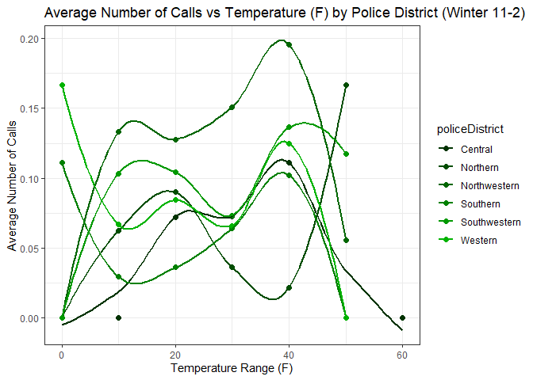
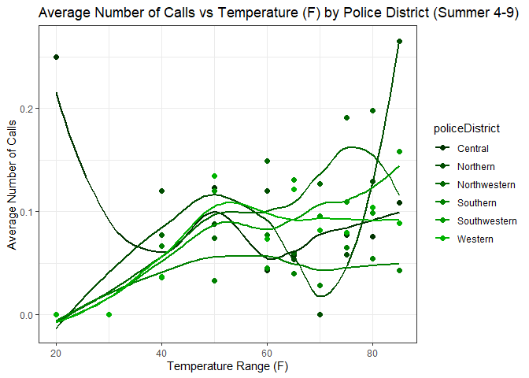
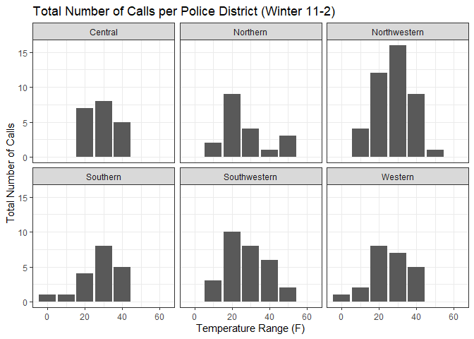
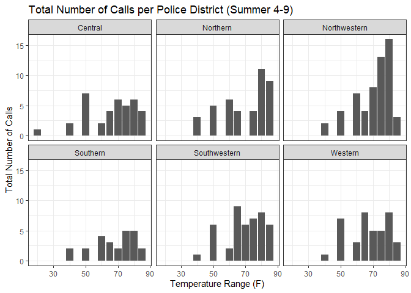

# How does high tempuratures affect mental health in Baltimore City?


This code segment is for installing packages:

``` r
install.packages("tidyverse")
install.packages("kableExtra")
install.packages("terra")
```

These are the packages we will be using:

``` r
library("tidyverse")
library("kableExtra")
library("terra")
```

This code segment is for opening the csv file and storing the contents
in a dataframe df. 4 additional columns are created for call_bin, date,
month. dow.

``` r
df<-read.csv("panel_utci.csv")
df2<-df %>%
  mutate(call_bin = ifelse(callscount>0, 1, 0)) %>%
  mutate(date = as.Date(date)) %>%
  mutate(year = year(date)) %>%
  mutate(month = month(date)) %>%
  mutate(dow = weekdays(date)) %>%
  mutate(utci_F = (UTCI-273.15)*9/5 + 32)
```

The table below shows the first ten observations of our data frame.

``` r
kable(head(df2))
```

| daytime | policeDistrict | date | actual_date | year | doy | temp_K | callscount | temp_F | UTCI | call_bin | month | dow | utci_F |
|---:|:---|:---|---:|---:|---:|---:|---:|---:|---:|---:|---:|:---|---:|
| 0 | Central | 2021-06-06 | 2021156 | 2021 | 156 | 294.5450 | 0 | 70.51100 | 299.8173 | 0 | 6 | Sunday | 80.00109 |
| 0 | Central | 2021-06-07 | 2021157 | 2021 | 157 | 296.9489 | 0 | 74.83800 | 301.3752 | 0 | 6 | Monday | 82.80543 |
| 0 | Central | 2021-06-08 | 2021158 | 2021 | 158 | 298.5400 | 0 | 77.70200 | 302.2551 | 0 | 6 | Tuesday | 84.38918 |
| 0 | Central | 2021-06-17 | 2021167 | 2021 | 167 | 293.4029 | 0 | 68.45514 | 292.2729 | 0 | 6 | Thursday | 66.42120 |
| 0 | Central | 2021-06-19 | 2021169 | 2021 | 169 | 292.4600 | 0 | 66.75800 | 296.2358 | 0 | 6 | Saturday | 73.55447 |
| 0 | Central | 2021-06-26 | 2021176 | 2021 | 176 | 292.9914 | 0 | 67.71457 | 297.0104 | 0 | 6 | Saturday | 74.94876 |

## Introduction & Literature Review:

Understanding how temperature affects mental health is crucial for
society. With rising global temperatures, we will have to be prepared
for any impacts that may cause. The years from 2013 to 2023 have been
the warmest to date, with 2023 having the highest surface temperature
ever recorded (NASA, n.d). High temperatures were studied in Baltimore
city through in depth interviews where it was found that at higher heats
people were more prone to mental health problems such as depression and
anxiety. Especially disadvantaged individuals such as people who are
low-income, have disabilities, are homeless, pregnant, elderly people
and children (Diallo et al., 2024). If we were to discover more impacts
that temperature has on individuals, it could guide urban planners to
plan future cities so that they would include public spaces throughout
the city. Additionally, by understanding the psychological effects of
temperature, governments and healthcare providers can better prepare
interventions, such as improving access to mental health services during
extreme temperatures. This research could also lead to targeted policies
that aim to mitigate the mental health impacts of climate change,
ultimately improving societal well-being.

This research project aims to provide the most concentrated area example
of the impacts of temperature on mental health. While existing studies
have found links between mental health worsening and high temperatures,
most have done so for the whole country of the US by county, which makes
it more difficult to definitively control for other factors (Burke et
al., 2018; Srivastava & Mullins., 2024). The data used by Burke et
al. (2018) is based on suicide rates and is from 1968–2004 in the US and
1990-2010 in Mexico by county and analyzed monthly. They found a 0.7%
suicide rate increase in the US per 1.8 degrees Fahrenheit increase in
monthly temperature. 

Srivastava & Mullins (2024) compared the daily frequencies of crisis
line conversations from each county with local average daily
temperatures. They found an 8% increase in crisis line conversations on
days exceeding 86 degrees Fahrenheit compared to days between 64.4 to
69.8 degrees Fahrenheit. 

Besides existing studies on the link between temperatures and mental
health, there are many studies that looked at the impact of temperature
on crime rates. Heilmann et al. (2021) discovered that crime rates in
Los Angeles police districts increase 1.72% when daily temperature
exceeds 75 and 1.90% when daily temperature exceeds 75 and 90 degrees
Fahrenheit. 

Our study will differ from existing studies on temperature and mental
health on several key points. We will be analyzing a more controlled
location and group, focussing on Baltimore City, allowing us to control
for factors specific to the police district. We will be using some of
the same strategies as other studies (Burke et al., 2018; Srivastava &
Mullins., 2024; Heilmann et al., 2021) such as controlling for factors
of precipitation, air quality, and holidays. As well as adding an extra
factor of our own, greenspace. Our data will be more modern mental
health crisis call data from 2021-2023 and analyzed daily to account for
factors such as day of week.

**Bibliography:** 

Burke, M., González, F., Baylis, P., Heft-Neal, S., Baysan, C., Basu,
S., & Hsiang, S. (2018). Higher temperatures increase suicide rates in
the United States and Mexico. Nature Climate Change, 8(8), 723–729.
<https://doi.org/10.1038/s41558-018-0222-x> 

Change, N. G. C. (n.d.). Global Surface Temperature \| NASA Global
Climate Change. Climate Change: Vital Signs of the Planet. Retrieved
October 22, 2024, from
<https://climate.nasa.gov/vital-signs/global-temperature/?intent=121> 

Diallo, I., He, L., Koehler, K., Spira, A. P., Kale, R., Ou, J., Smith,
G., Linton, S. L., & Augustinavicius, J. (2024). Community perspectives
on heat and health in Baltimore City. Urban Climate, 54, 101841.
<https://doi.org/10.1016/j.uclim.2024.101841> 

Heilmann, K., Kahn, M. E., & Tang, C. K. (2021). The urban crime and
heat gradient in high and low poverty areas. Journal of Public
Economics, 197, 104408. <https://doi.org/10.1016/j.jpubeco.2021.104408>

Srivastava, S., & Mullins, J. T. (2024). Temperature, Mental Health, and
Individual Crises: Evidence from Crisis Text Line. American Journal of
Health Economics. <https://doi.org/10.1086/730332> 

## Methods:

The frequency of this data frame is Daily.

The cross-sectional unit of this data frame is the Police district.

The column the treatment variable of interest in temp_F.

The column that represents the outcome variable of interest is call_bin.

This code block displays all of the variables in df2.

``` r
names(df2)
```

     [1] "daytime"        "policeDistrict" "date"           "actual_date"   
     [5] "year"           "doy"            "temp_K"         "callscount"    
     [9] "temp_F"         "UTCI"           "call_bin"       "month"         
    [13] "dow"            "utci_F"        

Shows 2 scatter plots split by winter and summer. Compares the average
number of calls received with the temperature by police district.

First scatter plot represents the relationship between the temperature
and the amount of calls received based on the police districts during
winter. Second scatter plot represents the same relationship but for the
summer.

``` r
# histogram or scatterplots
# total number of calls
# x -> temp_F, y -> callscount (avg for scatterplot)
# groupBy policeDistrict

df2 <- df2 %>%
  mutate(tempCatagories = ifelse(utci_F < 10, 0,
                          ifelse(utci_F >= 10 & utci_F < 20, 10,
                          ifelse(utci_F >= 20 & utci_F < 30, 20,
                          ifelse(utci_F >= 30 & utci_F < 40, 30,
                          ifelse(utci_F >= 40 & utci_F < 50, 40,
                          ifelse(utci_F >= 50 & utci_F < 60, 50,
                          ifelse(utci_F >= 60 & utci_F < 65, 60,
                          ifelse(utci_F >= 65 & utci_F < 70, 65,
                          ifelse(utci_F >= 70 & utci_F < 75, 70,
                          ifelse(utci_F >= 75 & utci_F < 80, 75,
                          ifelse(utci_F >= 80 & utci_F < 85, 80,
                          ifelse(utci_F >= 85 & utci_F < 90, 85,
                          ifelse(utci_F >= 90 & utci_F < 95, 90,
                          ifelse(utci_F >= 95 & utci_F < 100, 95, 
                          100)))))))))))))))


# if 0 -> summer (4 - 9)
# if 1 -> winter (11 - 2)
# if 2 -> march and october
df2 <- df2 %>%
  mutate(seasons = ifelse(month >= 4 & month <= 9, 0,
                      ifelse(month <= 2 | month >= 11, 1,
                             2)))
         
# for winter
winter_df <- df2 %>%
  filter(seasons == 1) %>%
  group_by(policeDistrict, tempCatagories) %>%
  summarise(avg_calls = mean(callscount, na.rm = TRUE))

# for summer
summer_df <- df2 %>%
  filter(seasons == 0) %>%
  group_by(policeDistrict, tempCatagories) %>%
  summarise(avg_calls = mean(callscount, na.rm = TRUE))

# Scatter plot -winter
greenPalette <- c("#003300", "#004d00", "#006600", "#008000", "#009900", "#00b300", "#00cc00", "#33cc33", "#66ff66")

ggplot(winter_df, aes(x = tempCatagories, y = avg_calls, color = policeDistrict)) + 
  geom_point(size = 2) + 
  geom_smooth(se = FALSE) +
  scale_color_manual(values = greenPalette) +
  labs(title = "Average Number of Calls vs Temperature (F) by Police District (Winter 11-2)",
       x = "Temperature Range (F)", 
       y = "Average Number of Calls") +
  theme_bw()
```



``` r
# Scatter plot -summer
ggplot(summer_df, aes(x = tempCatagories, y = avg_calls, color = policeDistrict)) + 
  geom_point(size = 2) + 
  geom_smooth(se = FALSE) +
  scale_color_manual(values = greenPalette) +
  #scale_color_manual(values = c("#006400", "#228B22", "#32CD32", "#7FFF00", "#ADFF2F")) +
  labs(title = "Average Number of Calls vs Temperature (F) by Police District (Summer 4-9)",
       x = "Temperature Range (F)", 
       y = "Average Number of Calls") +
  theme_bw()
```



``` r
#----------------------------------------------------------------------------------------------
# We will not be using these graphs (I think so)


# for winter
df_winter <- df2 %>%
  filter(seasons == 1) %>%
  group_by(policeDistrict, tempCatagories) %>%
  summarize(total_callscount = sum(callscount))

# for summer
df_summer <- df2 %>%
  filter(seasons == 0) %>%
  group_by(policeDistrict, tempCatagories) %>%
  summarize(total_callscount = sum(callscount))

# Grouped bar graph -winter
ggplot(df_winter, aes(x = tempCatagories, y = total_callscount)) + 
    geom_bar(stat="identity") +
    facet_wrap((~ as.character(policeDistrict))) +
    labs(title = "Total Number of Calls per Police District (Winter 11-2)",
       x = "Temperature Range (F)", 
       y = "Total Number of Calls") +
  theme_bw()
```



``` r
# Grouped bar graph -summer
ggplot(df_summer, aes(x = tempCatagories, y = total_callscount)) + 
    geom_bar(stat="identity") +
    facet_wrap((~ as.character(policeDistrict))) +
    labs(title = "Total Number of Calls per Police District (Summer 4-9)",
       x = "Temperature Range (F)", 
       y = "Total Number of Calls") +
  theme_bw()
```



  
The following shows our regression model
$y=\beta_0 + \beta_1 x + \epsilon$ where $y$ is the outcome variable and
$x$ is the treatment variable.

``` r
model1<-lm(call_bin ~ utci_F, data=df2)

summary(model1)
```


    Call:
    lm(formula = call_bin ~ utci_F, data = df2)

    Residuals:
         Min       1Q   Median       3Q      Max 
    -0.08999 -0.08530 -0.08028 -0.07540  0.93160 

    Coefficients:
                 Estimate Std. Error t value Pr(>|t|)    
    (Intercept) 0.0677863  0.0097574   6.947 4.15e-12 ***
    utci_F      0.0002485  0.0001703   1.459    0.145    
    ---
    Signif. codes:  0 '***' 0.001 '**' 0.01 '*' 0.05 '.' 0.1 ' ' 1

    Residual standard error: 0.2728 on 5579 degrees of freedom
    Multiple R-squared:  0.0003815, Adjusted R-squared:  0.0002023 
    F-statistic: 2.129 on 1 and 5579 DF,  p-value: 0.1446

Our linear regression equation.

$$
callscount_{pdt} = \beta_0 + \beta_1 temp_{pdt} + \gamma_p + \eta_d + \theta_{dayofweek} + \omega_{month} + \pi_{year}+\epsilon_{pdt}
$$

Where $callscount$ represents the outcome variable that shows whether
there a call from police district \$p\$, on day \$d\$, at time of day
\$t\$.

Where $temp$ determines the temperature in Fahrenheit.

Data Description:

- Outcome variable: whether there was a call or not per day.

- Treatment variable: temperature

- Frequency and geographical Unit: daily day and night and police
  district

- Treated Group: \# of call on a hot weekday in a specific month in a
  police district

- Untreated Group:# of call on a cool weekday in a specific month in a
  police district

Fixed effects:

- Police district: controls for better or worse conditions in the city

- DOW: controls any differences that might have occurred one day to
  another

- Month: controls any differences that might have occurred one month to
  another

- Year: controls any differences that might have occurred one year to
  another

## 

The following code segments create new column holiday_bin is created
which represents whether there was a school holiday or or not.
Additionally, they create 4 regression models which help us understand
the effect temperature and holidays play on mental health calls. We
split these models for the winter and summer.

``` r
#install.packages("lfe")
library("lfe")

model2<-felm(call_bin ~ utci_F | 
               policeDistrict + year + month + dow, data=df2)

summary(model2)
```


    Call:
       felm(formula = call_bin ~ utci_F | policeDistrict + year + month +      dow, data = df2) 

    Residuals:
         Min       1Q   Median       3Q      Max 
    -0.15866 -0.09589 -0.07684 -0.05614  0.98272 

    Coefficients:
            Estimate Std. Error t value Pr(>|t|)  
    utci_F 0.0007285  0.0004112   1.772   0.0765 .
    ---
    Signif. codes:  0 '***' 0.001 '**' 0.01 '*' 0.05 '.' 0.1 ' ' 1

    Residual standard error: 0.2722 on 5555 degrees of freedom
    Multiple R-squared(full model): 0.009347   Adjusted R-squared: 0.004889 
    Multiple R-squared(proj model): 0.0005649   Adjusted R-squared: -0.003933 
    F-statistic(full model):2.097 on 25 and 5555 DF, p-value: 0.001106 
    F-statistic(proj model):  3.14 on 1 and 5555 DF, p-value: 0.07647 
    *** Standard errors may be too high due to more than 2 groups and exactDOF=FALSE

``` r
# for the temperature range
df3<-df2 %>%
  mutate(utci_over_100=ifelse(utci_F>100, 1, 0)) %>%
  mutate(utci_95_100=ifelse(utci_F> 95 & utci_F<=100, 1, 0)) %>%
  mutate(utci_90_95=ifelse(utci_F> 90 & utci_F<=95, 1, 0)) %>%
  mutate(utci_85_90=ifelse(utci_F> 85 & utci_F<=90, 1, 0)) %>%
  mutate(utci_80_85=ifelse(utci_F> 80 & utci_F<=85, 1, 0)) %>%
  mutate(utci_75_80=ifelse(utci_F> 75 & utci_F<=80, 1, 0)) %>%
  mutate(utci_70_75=ifelse(utci_F> 70 & utci_F<=75, 1, 0)) %>%
  mutate(utci_65_70=ifelse(utci_F> 65 & utci_F<=70, 1, 0)) %>%
  mutate(utci_60_65=ifelse(utci_F> 60 & utci_F<=65, 1, 0)) %>%
  mutate(utci_55_60=ifelse(utci_F> 55 & utci_F<=60, 1, 0)) %>%
  mutate(utci_50_55=ifelse(utci_F> 50 & utci_F<=55, 1, 0)) %>%
  mutate(utci_45_50=ifelse(utci_F> 45 & utci_F<=50, 1, 0)) %>%
  mutate(utci_40_45=ifelse(utci_F> 40 & utci_F<=45, 1, 0)) %>%
  mutate(utci_35_40=ifelse(utci_F> 35 & utci_F<=40, 1, 0)) %>%
  mutate(utci_30_35=ifelse(utci_F> 30 & utci_F<=35, 1, 0)) %>%
  mutate(utci_25_30=ifelse(utci_F> 25 & utci_F<=30, 1, 0)) %>%
  mutate(utci_20_25=ifelse(utci_F> 20 & utci_F<=25, 1, 0)) %>%
  mutate(utci_15_20=ifelse(utci_F> 15 & utci_F<=20, 1, 0)) %>%
  mutate(utci_10_15=ifelse(utci_F> 10 & utci_F<=15, 1, 0)) %>%
  mutate(utci_5_10=ifelse(utci_F> 5 & utci_F<=10, 1, 0)) %>%
  mutate(utci_0_5=ifelse(utci_F> 0 & utci_F<=5, 1, 0)) %>%
  mutate(utci_under_0=ifelse(utci_F<= 0, 1, 0))
#-------#

#2021 - 2022 (from the website: https://patch.com/maryland/baltimore/back-school-baltimore-city #-2021-22-school-calendar) (Not full but )
#2022 - 2023
#2023 - 2024 (upto Dec 31)

holidays <- as.Date(c(
"2021-5-31", "2021-6-19", "2021-7-4",

"2021-9-6", "2021-11-2", "2021-11-25", "2021-11-26", "2021-12-24", "2021-12-25", "2021-12-26", "2021-12-27", "2021-12-28", "2021-12-29", "2021-12-30", "2021-12-31", "2022-1-1", "2022-1-2", "2022-1-17", "2022-2-18", "2022-2-21", "2022-3-18", "2022-4-11", "2022-4-12", "2022-4-13", "2022-4-14", "2022-4-15", "2022-4-16", "2022-4-17", "2022-4-18", "2022-5-30", "2022-6-19", "2022-7-4",

"2022-9-5", "2022-10-5", "2022-10-21", "2022-11-8", "2022-11-9", "2022-11-23", "2022-11-24", "2022-11-25", "2022-12-23", "2022-12-24", "2022-12-25", "2021-12-26", "2022-12-27", "2022-12-28", "2022-12-29", "2022-12-30", "2022-12-31", "2023-01-01", "2023-1-2", "2023-1-16", "2023-1-23", "2023-2-17", "2023-2-20", "2023-3-8", "2023-3-17", "2023-4-3", "2023-4-4", "2023-4-5", "2023-4-6", "2023-4-7", "2023-4-8", "2023-4-9", "2023-4-10", "2023-4-21", "2023-5-29",  "2023-6-19", "2023-7-4", 

"2023-9-4", "2023-10-20", "2023-11-22", "2023-11-23", "2023-11-24", "2023-12-22", "2023-12-23", "2023-12-24", "2023-12-25", "2023-12-26", "2023-12-27", "2023-12-28", "2023-12-29", "2023-12-30", "2023-12-31"))

#For adding the holidays column into the data frame
df3 <- df3 %>%
  mutate(holiday_bin = ifelse(date %in% holidays, 1, 0))

#-------#
# split these into 2 for winter non winter months


# This is for the winter months

# We should focus on the tempurature range 45- 50 as it the most significant
df4w<-df3 %>%
  filter(seasons == 1)

model2<-felm(call_bin ~ utci_60_65 + utci_55_60 + utci_50_55 +
               utci_45_50 + utci_40_45 + utci_35_40 + utci_30_35 + utci_25_30 +
               utci_20_25 + utci_15_20 + utci_10_15 + utci_5_10 + utci_0_5 +
               utci_under_0  +
               holiday_bin |
               policeDistrict + year + month + dow, data=df4w)

summary(model2)
```


    Call:
       felm(formula = call_bin ~ utci_60_65 + utci_55_60 + utci_50_55 +      utci_45_50 + utci_40_45 + utci_35_40 + utci_30_35 + utci_25_30 +      utci_20_25 + utci_15_20 + utci_10_15 + utci_5_10 + utci_0_5 +      utci_under_0 + holiday_bin | policeDistrict + year + month +      dow, data = df4w) 

    Residuals:
         Min       1Q   Median       3Q      Max 
    -0.22191 -0.09703 -0.06768 -0.03721  1.01686 

    Coefficients:
                  Estimate Std. Error t value Pr(>|t|)
    utci_60_65   -0.001316   0.306354  -0.004    0.997
    utci_55_60    0.012724   0.159465   0.080    0.936
    utci_50_55    0.047404   0.159006   0.298    0.766
    utci_45_50    0.103587   0.156368   0.662    0.508
    utci_40_45    0.083384   0.155420   0.537    0.592
    utci_35_40    0.044779   0.154818   0.289    0.772
    utci_30_35    0.057438   0.154966   0.371    0.711
    utci_25_30    0.066438   0.154672   0.430    0.668
    utci_20_25    0.040889   0.155295   0.263    0.792
    utci_15_20    0.051540   0.157123   0.328    0.743
    utci_10_15    0.039021   0.156882   0.249    0.804
    utci_5_10     0.028974   0.163623   0.177    0.859
    utci_0_5      0.044166   0.165471   0.267    0.790
    utci_under_0       NaN         NA     NaN      NaN
    holiday_bin  -0.005069   0.018230  -0.278    0.781

    Residual standard error: 0.2634 on 1835 degrees of freedom
    Multiple R-squared(full model): 0.02295   Adjusted R-squared: 0.006978 
    Multiple R-squared(proj model): 0.00461   Adjusted R-squared: -0.01166 
    F-statistic(full model):1.437 on 30 and 1835 DF, p-value: 0.05943 
    F-statistic(proj model): 0.5665 on 15 and 1835 DF, p-value: 0.9018 
    *** Standard errors may be too high due to more than 2 groups and exactDOF=FALSE

``` r
# model3<-felm(call_bin ~ utci_over_100:as.factor(policeDistrict) + 
#                utci_95_100:as.factor(policeDistrict) + 
#                utci_90_95:as.factor(policeDistrict) + 
#                utci_85_90:as.factor(policeDistrict) + 
#                utci_80_85:as.factor(policeDistrict) +
#                utci_75_80:as.factor(policeDistrict) + 
#                utci_70_75:as.factor(policeDistrict) + 
#                utci_65_70:as.factor(policeDistrict) + 
#                utci_60_65:as.factor(policeDistrict) + 
#                utci_50_55:as.factor(policeDistrict) + 
#                utci_45_50:as.factor(policeDistrict) + 
#                utci_40_45:as.factor(policeDistrict) + 
#                utci_35_40:as.factor(policeDistrict) + 
#                utci_30_35:as.factor(policeDistrict) + 
#                utci_25_30:as.factor(policeDistrict) + 
#                utci_20_25:as.factor(policeDistrict) + 
#                utci_15_20:as.factor(policeDistrict) + 
#                utci_10_15:as.factor(policeDistrict) + 
#                utci_5_10:as.factor(policeDistrict) + 
#                utci_0_5:as.factor(policeDistrict) + 
#                utci_under_0:as.factor(policeDistrict) + 
#                holiday_bin | year + month + dow, data=df4w)
# 
# summary(model3)

#-------#


# This is for the summer months
df4s<-df3 %>%
  filter(seasons == 0)

model4<-felm(call_bin ~ utci_over_100 + utci_95_100 + utci_90_95 + utci_85_90 +
               utci_80_85 + utci_75_80 + utci_70_75 + utci_65_70 + utci_60_65 +
               utci_55_60 + utci_50_55 + utci_45_50 + utci_40_45 + utci_35_40 +
               utci_30_35 + utci_25_30 + utci_20_25 + holiday_bin |
               policeDistrict + year + month + dow, data=df4s)

# model5<-felm(call_bin ~ utci_over_100:as.factor(policeDistrict) + 
#                utci_95_100:as.factor(policeDistrict) + 
#                utci_90_95:as.factor(policeDistrict) + 
#                utci_85_90:as.factor(policeDistrict) + 
#                utci_80_85:as.factor(policeDistrict) +
#                utci_75_80:as.factor(policeDistrict) + 
#                utci_70_75:as.factor(policeDistrict) + 
#                utci_65_70:as.factor(policeDistrict) + 
#                utci_60_65:as.factor(policeDistrict) + 
#                utci_50_55:as.factor(policeDistrict) + 
#                utci_45_50:as.factor(policeDistrict) + 
#                utci_40_45:as.factor(policeDistrict) + 
#                utci_35_40:as.factor(policeDistrict) + 
#                utci_30_35:as.factor(policeDistrict) + 
#                utci_25_30:as.factor(policeDistrict) + 
#                utci_20_25:as.factor(policeDistrict) + 
#                utci_15_20:as.factor(policeDistrict) + 
#                utci_10_15:as.factor(policeDistrict) + 
#                utci_5_10:as.factor(policeDistrict) + 
#                utci_0_5:as.factor(policeDistrict) + 
#                utci_under_0:as.factor(policeDistrict) + 
#                holiday_bin | year + month + dow, data=df4s)

summary(model4)
```


    Call:
       felm(formula = call_bin ~ utci_over_100 + utci_95_100 + utci_90_95 +      utci_85_90 + utci_80_85 + utci_75_80 + utci_70_75 + utci_65_70 +      utci_60_65 + utci_55_60 + utci_50_55 + utci_45_50 + utci_40_45 +      utci_35_40 + utci_30_35 + utci_25_30 + utci_20_25 + holiday_bin |      policeDistrict + year + month + dow, data = df4s) 

    Residuals:
         Min       1Q   Median       3Q      Max 
    -0.18607 -0.10064 -0.07445 -0.04411  1.00326 

    Coefficients:
                  Estimate Std. Error t value Pr(>|t|)
    utci_over_100      NaN         NA     NaN      NaN
    utci_95_100        NaN         NA     NaN      NaN
    utci_90_95         NaN         NA     NaN      NaN
    utci_85_90     0.08339    0.07962   1.047    0.295
    utci_80_85     0.07572    0.07871   0.962    0.336
    utci_75_80     0.07783    0.07813   0.996    0.319
    utci_70_75     0.04408    0.07805   0.565    0.572
    utci_65_70     0.05771    0.07703   0.749    0.454
    utci_60_65     0.06481    0.07681   0.844    0.399
    utci_55_60     0.07820    0.07664   1.020    0.308
    utci_50_55     0.02154    0.07805   0.276    0.783
    utci_45_50     0.05275    0.08078   0.653    0.514
    utci_40_45     0.04407    0.07841   0.562    0.574
    utci_35_40    -0.01707    0.09959  -0.171    0.864
    utci_30_35         NaN         NA     NaN      NaN
    utci_25_30     0.02889    0.10311   0.280    0.779
    utci_20_25    -0.04019    0.13321  -0.302    0.763
    holiday_bin    0.03536    0.02392   1.478    0.139

    Residual standard error: 0.2703 on 2728 degrees of freedom
    Multiple R-squared(full model): 0.01985   Adjusted R-squared: 0.008351 
    Multiple R-squared(proj model): 0.004392   Adjusted R-squared: -0.007287 
    F-statistic(full model):1.726 on 32 and 2728 DF, p-value: 0.006957 
    F-statistic(proj model): 0.6686 on 18 and 2728 DF, p-value: 0.845 
    *** Standard errors may be too high due to more than 2 groups and exactDOF=FALSE

``` r
#summary(model5)
```

There are 2 different maps. The summer map represents the regressions in
the summer per police district in Baltimore city. The winter map
represents the regression in the winter per police district in Baltimore
city.

``` r
# for summer
model6<-felm(call_bin ~ utci_F:as.factor(policeDistrict) +
               holiday_bin |
               year + month + dow, data=df4s)
               #policeDistrict + year + month + dow, data=df4s)

summary(model6)
```


    Call:
       felm(formula = call_bin ~ utci_F:as.factor(policeDistrict) +      holiday_bin | year + month + dow, data = df4s) 

    Residuals:
         Min       1Q   Median       3Q      Max 
    -0.19303 -0.09955 -0.07200 -0.04535  0.99264 

    Coefficients:
                                                  Estimate Std. Error t value
    holiday_bin                                  0.0305369  0.0230856   1.323
    utci_F:as.factor(policeDistrict)Central      0.0010665  0.0007155   1.490
    utci_F:as.factor(policeDistrict)Northern     0.0013444  0.0007154   1.879
    utci_F:as.factor(policeDistrict)Northwestern 0.0016948  0.0007157   2.368
    utci_F:as.factor(policeDistrict)Southern     0.0007529  0.0007126   1.056
    utci_F:as.factor(policeDistrict)Southwestern 0.0013364  0.0007166   1.865
    utci_F:as.factor(policeDistrict)Western      0.0012210  0.0007170   1.703
                                                 Pr(>|t|)  
    holiday_bin                                    0.1860  
    utci_F:as.factor(policeDistrict)Central        0.1362  
    utci_F:as.factor(policeDistrict)Northern       0.0603 .
    utci_F:as.factor(policeDistrict)Northwestern   0.0179 *
    utci_F:as.factor(policeDistrict)Southern       0.2908  
    utci_F:as.factor(policeDistrict)Southwestern   0.0623 .
    utci_F:as.factor(policeDistrict)Western        0.0887 .
    ---
    Signif. codes:  0 '***' 0.001 '**' 0.01 '*' 0.05 '.' 0.1 ' ' 1

    Residual standard error: 0.2699 on 2740 degrees of freedom
    Multiple R-squared(full model): 0.01804   Adjusted R-squared: 0.01087 
    Multiple R-squared(proj model): 0.007844   Adjusted R-squared: 0.0006021 
    F-statistic(full model):2.516 on 20 and 2740 DF, p-value: 0.0002192 
    F-statistic(proj model): 3.095 on 7 and 2740 DF, p-value: 0.00298 
    *** Standard errors may be too high due to more than 2 groups and exactDOF=FALSE

``` r
# for winter
model7<-felm(call_bin ~ utci_F:as.factor(policeDistrict) +
               holiday_bin |
               year + month + dow, data=df4w)
               #policeDistrict + year + month + dow, data=df4w)

summary(model7)
```


    Call:
       felm(formula = call_bin ~ utci_F:as.factor(policeDistrict) +      holiday_bin | year + month + dow, data = df4w) 

    Residuals:
         Min       1Q   Median       3Q      Max 
    -0.19875 -0.09322 -0.06862 -0.04286  1.00216 

    Coefficients:
                                                   Estimate Std. Error t value
    holiday_bin                                  -4.419e-04  1.734e-02  -0.025
    utci_F:as.factor(policeDistrict)Central       2.542e-04  7.474e-04   0.340
    utci_F:as.factor(policeDistrict)Northern      8.232e-05  7.468e-04   0.110
    utci_F:as.factor(policeDistrict)Northwestern  1.800e-03  7.487e-04   2.404
    utci_F:as.factor(policeDistrict)Southern     -2.182e-04  7.350e-04  -0.297
    utci_F:as.factor(policeDistrict)Southwestern  9.545e-04  7.478e-04   1.276
    utci_F:as.factor(policeDistrict)Western       3.273e-04  7.536e-04   0.434
                                                 Pr(>|t|)  
    holiday_bin                                    0.9797  
    utci_F:as.factor(policeDistrict)Central        0.7339  
    utci_F:as.factor(policeDistrict)Northern       0.9122  
    utci_F:as.factor(policeDistrict)Northwestern   0.0163 *
    utci_F:as.factor(policeDistrict)Southern       0.7666  
    utci_F:as.factor(policeDistrict)Southwestern   0.2019  
    utci_F:as.factor(policeDistrict)Western        0.6641  
    ---
    Signif. codes:  0 '***' 0.001 '**' 0.01 '*' 0.05 '.' 0.1 ' ' 1

    Residual standard error: 0.2632 on 1847 degrees of freedom
    Multiple R-squared(full model): 0.01863   Adjusted R-squared: 0.00907 
    Multiple R-squared(proj model): 0.007737   Adjusted R-squared: -0.001933 
    F-statistic(full model):1.948 on 18 and 1847 DF, p-value: 0.009754 
    F-statistic(proj model): 2.057 on 7 and 1847 DF, p-value: 0.04504 
    *** Standard errors may be too high due to more than 2 groups and exactDOF=FALSE

``` r
library("terra")


police_districts<-vect("Police_Districts_2023/Police_Districts_2023.shp")

# for summer
police_districts$trt_summer <- 0
police_districts$trt_summer[police_districts$Dist_Name=="Central"] <- 0.0002573*100
police_districts$trt_summer[police_districts$Dist_Name=="Northern"] <- 0.0018448*100
police_districts$trt_summer[police_districts$Dist_Name=="Northwestern"] <- 0.0023366*100
police_districts$trt_summer[police_districts$Dist_Name=="Southern"] <- 0.0004345*100
police_districts$trt_summer[police_districts$Dist_Name=="Southwestern"] <- 0.0015275*100
police_districts$trt_summer[police_districts$Dist_Name=="Western"] <- 0.0010721*100

png("map_summer_utci.png", width=6, height=4, unit="in", res=500)
plot(police_districts, "trt_summer", col=map.pal("greens"))
dev.off()
```

    png 
      2 

``` r
# for winter
police_districts$trt_winter <- 0

police_districts$trt_winter[police_districts$Dist_Name=="Central"] <- 2.542e-02
police_districts$trt_winter[police_districts$Dist_Name=="Northern"] <- 8.232e-03
police_districts$trt_winter[police_districts$Dist_Name=="Northwestern"] <- 1.800e-01
police_districts$trt_winter[police_districts$Dist_Name=="Southern"] <- -2.182e-02
police_districts$trt_winter[police_districts$Dist_Name=="Southwestern"] <- 9.545e-02
police_districts$trt_winter[police_districts$Dist_Name=="Western"] <- 3.273e-02

png("map_winter_utci.png", width=6, height=4, unit="in", res=500)
plot(police_districts, "trt_winter", col=map.pal("greens"))
dev.off()
```

    png 
      2 

Future Plans:

- Alter the graph so that it shows the relationship between specific
  temperature periods to the number of calls

- Incorporate methods and strategies from official articles into our
  research paper.

- Control for trees, precipitation and air quality

- Identify factors that impacts temperature and number of calls at the
  same time.

  - precipitation

  - trees

  - air quality
